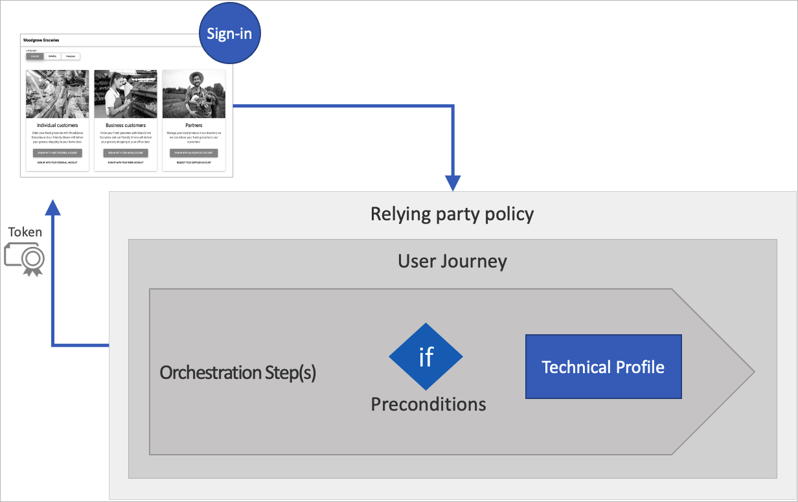
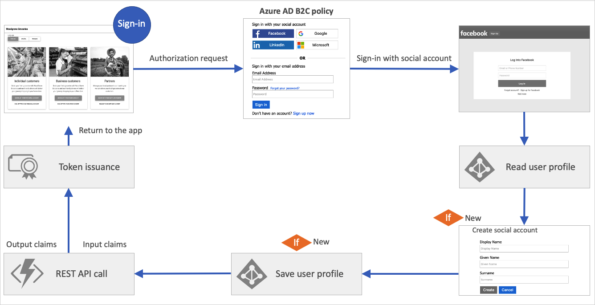
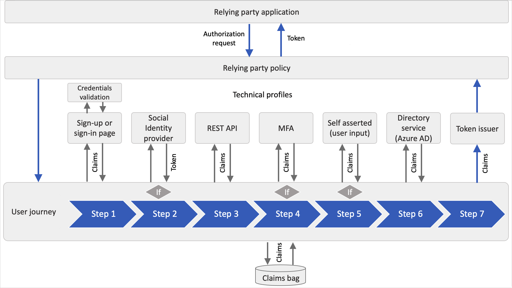
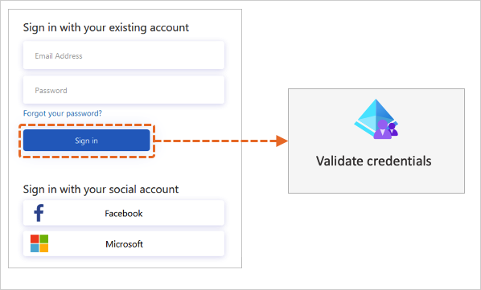
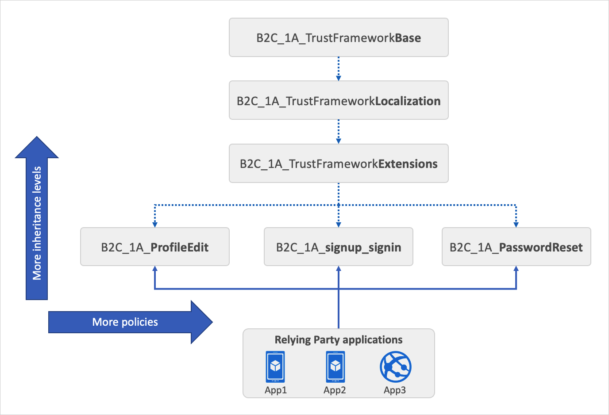

# Azure AD B2C custom policy overview

Custom policies are configuration files that define the behavior of your Azure Active Directory B2C (Azure AD B2C) tenant. While [user flows](user-flow-overview.md) are predefined in the Azure AD B2C portal for the most common identity tasks, an identity developer can edit custom policies to complete many different tasks.

A custom policy is fully configurable and policy-driven. A custom policy orchestrates trust between entities in standard protocols. For example, OpenID Connect, OAuth, SAML, and a few nonstandard ones, for example REST API-based system-to-system claims exchanges. The framework creates user-friendly, white-labeled experiences.

A custom policy is represented as one or more XML-formatted files, which refer to each other in a hierarchical chain. The XML elements define the building blocks, the interaction with the user, and other parties, and the business logic. 

## Custom policy starter pack

Azure AD B2C custom policy [starter pack](tutorial-create-user-flows.md?pivots=b2c-custom-policy#get-the-starter-pack) comes with several prebuilt policies to get you started quickly. Each of these starter packs contains the smallest number of technical profiles and user journeys needed to achieve the scenarios described:

- **LocalAccounts** - Enables the use of local accounts only.
- **SocialAccounts** - Enables the use of social (or federated) accounts only.
- **SocialAndLocalAccounts** - Enables the use of both local and social accounts. Most of our samples refer to this policy.
- **SocialAndLocalAccountsWithMFA** - Enables social, local, and multifactor authentication options.

In the [Azure AD B2C samples GitHub repository](https://github.com/azure-ad-b2c/samples), you find samples for several enhanced Azure AD B2C custom CIAM user journeys and scenarios. For example, local account policy enhancements, social account policy enhancements, MFA enhancements, user interface enhancements, generic enhancements, app migration, user migration, conditional access, web test, and CI/CD.
 
## Understanding the basics 

### Claims

A claim provides temporary storage of data during an Azure AD B2C policy execution. Claims are more like variable in a programing language. It can store information about the user, such as first name, last name, or any other claim obtained from the user or other systems (claims exchanges). The [claims schema](claimsschema.md) is the place where you declare your claims. 

When the policy runs, Azure AD B2C sends and receives claims to and from internal and external parties and then sends a subset of these claims to your relying party application as part of the token. Claims are used in these ways: 

- A claim is saved, read, or updated against the directory user object.
- A claim is received from an external identity provider.
- Claims are sent or received using a custom REST API service.
- Data is collected as claims from the user during the sign-up or edit profile flows.

### Manipulating your claims

The [claims transformations](claimstransformations.md) are predefined functions that can be used to convert a given claim into another one, evaluate a claim, or set a claim value. For example adding an item to a string collection, changing the case of a string, or evaluate a date and time claim. A claims transformation specifies a transform method, which is also predefined. 

### Customize and localize your UI

To collect information from your users by presenting a page in their web browser, use the [self-asserted technical profile](self-asserted-technical-profile.md). You can edit your self-asserted technical profile to [add claims and customize user input](./configure-user-input.md).

To [customize the user interface](customize-ui-with-html.md) for your self-asserted technical profile, you specify a URL in the [content definition](contentdefinitions.md) element with customized HTML content. In the self-asserted technical profile, you point to this content definition ID.

To customize language-specific strings, use the [localization](localization.md) element. A content definition may contain a [localization](localization.md) reference that specifies a list of localized resources to load. Azure AD B2C merges user interface elements with the HTML content that's loaded from your URL and then displays the page to the user. 

## Relying party policy overview

A relying party application, which in the SAML protocol is known as a service provider, calls the [relying party policy](relyingparty.md) to execute a specific user journey. The relying party policy specifies the user journey to be executed, and list of claims that the token includes. 

All relying party applications that use the same policy receives the same token claims, and the user goes through the same user journey.

### User journeys

[User journeys](userjourneys.md) allows you to define the business logic with path through which user follows to gain access to your application. The user is taken through the user journey to retrieve the claims that are to be presented to your application. A user journey is built from a sequence of [orchestration steps](userjourneys.md#orchestrationsteps). A user must reach the last step to acquire a token. 

The following instructions describe how you can add orchestration steps to the [social and local account starter pack](https://github.com/Azure-Samples/active-directory-b2c-custom-policy-starterpack/tree/master/SocialAndLocalAccounts) policy. Here's an example of a REST API call that has been added.

### Orchestration steps

The orchestration step references to a method that implements its intended purpose or functionality. This method is called a [technical profile](technicalprofiles.md). When your user journey needs branching to better represent the business logic, the orchestration step references to [sub journey](subjourneys.md). A sub journey contains its own set of orchestration steps.

A user must reach the last orchestration step in the user journey to acquire a token. But users may not need to travel through all of the orchestration steps. Orchestration steps can be conditionally executed based on [preconditions](userjourneys.md#preconditions) defined in the orchestration step. 

After an orchestration step completes, Azure AD B2C stores the outputted claims in the **claims bag**. The claims in the claims bag can be utilized by any further orchestration steps in the user journey.

The following diagram shows how the user journey's orchestration steps can access the claims bag.

### Technical profile

A technical profile provides an interface to communicate with different types of parties. A user journey combines calling technical profiles via orchestration steps to define your business logic.

All types of technical profiles share the same concept. You send input claims, run claims transformation, and communicate with the configured party. After the process is completed, the technical profile returns the output claims to claims bag. For more information, see [technical profiles overview](technicalprofiles.md).

### Validation technical profile

When a user interacts with the user interface, you may want to validate the data that is collected. To interact with the user, a [self-asserted technical profile](self-asserted-technical-profile.md) must be used.

To validate the user input, a [validation technical profile](validation-technical-profile.md) is called from the self-asserted technical profile. A validation technical profile is a method to call any non-interactive technical profile. In this case, the technical profile can return output claims, or an error message. The error message is rendered to the user on screen, allowing the user to retry.

The following diagram illustrates how Azure AD B2C uses a validation technical profile to validate the user credentials.

## Inheritance model

Each [starter pack](https://github.com/Azure-Samples/active-directory-b2c-custom-policy-starterpack) includes the following files:

- A **Base** file that contains most of the definitions. To help with troubleshooting and long-term maintenance of your policies, try to minimize the number of changes you make to this file.
- A **Localization** file that holds the localization strings. This policy file is derived from the Base file. Use this file to accommodate different languages to suit your customer needs.
- An **Extensions** file that holds the unique configuration changes for your tenant. This policy file is derived from the Localization file. Use this file to add new functionality or override existing functionality. For example, use this file to federate with new identity providers.
- A **Relying Party (RP)** file that is the single task-focused file that is invoked directly by the relying party application, such as your web, mobile, or desktop applications. Each unique task, such as sign-up, sign-in, or profile edit, requires its own relying party policy file. This policy file is derived from the extensions file.

The inheritance model is as follows:

- The child policy at any level can inherit from the parent policy and extend it by adding new elements.
- For more complex scenarios, you can add more inheritance levels (up to 10 in total).
- You can add more relying party policies. For example, delete my account, change a phone number, SAML relying party policy and more.

The following diagram shows the relationship between the policy files and the relying party applications.

## Guidance and best practices

### Best practices

Within an Azure AD B2C custom policy, you can integrate your own business logic to build the user experiences you require and extend functionality of the service. We have a set of best practices and recommendations to get started.

- Create your logic within the **extension policy**, or **relying party policy**. You can add new elements, which overrides the base policy by referencing the same ID. This approach allows you to scale out your project while making it easier to upgrade base policy later on if Microsoft releases new starter packs.
- Within the **base policy**, we highly recommend avoiding making any changes. When necessary, make comments where the changes are made.
- When you're overriding an element, such as technical profile metadata, avoid copying the entire technical profile from the base policy. Instead, copy only the required section of the element. See [Disable email verification](./disable-email-verification.md) for an example of how to make the change.
- To reduce duplication of technical profiles, where core functionality is shared, use [technical profile inclusion](technicalprofiles.md#include-technical-profile).
- Avoid writing to the Microsoft Entra directory during sign-in, which may lead to throttling issues.
- If your policy has external dependencies, such as REST APIs, makes sure they're highly available.
- For a better user experience, make sure your custom HTML templates, are globally deployed using [online content delivery](../cdn/index.yml). Azure Content Delivery Network (CDN) lets you reduce load times, save bandwidth, and improve response speed.
- If you want to make a change to user journey, copy the entire user journey from the base policy to the extension policy. Provide a unique user journey ID to the user journey you've copied. Then in the [relying party policy](relyingparty.md), change the [default user journey](relyingparty.md#defaultuserjourney) element to point to the new user journey.

## Troubleshooting

When developing with Azure AD B2C policies, you may run into errors or exceptions while executing your user journey. The can be investigated using Application Insights.

- Integrate Application Insights with Azure AD B2C to [diagnose exceptions](troubleshoot-with-application-insights.md).
- The [Azure AD B2C extension for Visual Studio Code](https://marketplace.visualstudio.com/items?itemName=AzureADB2CTools.aadb2c) can help you access and [visualize the logs](https://github.com/azure-ad-b2c/vscode-extension/blob/master/src/help/app-insights.md) based on a policy name and time.
- The most common error in setting up custom policies is improperly formatted XML. Use [XML schema validation](./troubleshoot.md) to identify errors before you upload your XML file.

## Continuous integration

By using a continuous integration and delivery (CI/CD) pipeline that you set up in Azure Pipelines, you can [include your Azure AD B2C custom policies in your software delivery](deploy-custom-policies-devops.md) and code control automation. As you deploy to different Azure AD B2C environments, for example dev, test, and production, we recommend that you remove manual processes and perform automated testing by using Azure Pipelines.

## Prepare your environment

You get started with Azure AD B2C custom policy:

1. [Create an Azure AD B2C tenant](tutorial-create-tenant.md)
1. [Register a web application](tutorial-register-applications.md) using the Azure portal so you'll be able to test your policy.
1. Add the necessary [policy keys](tutorial-create-user-flows.md?pivots=b2c-custom-policy#add-signing-and-encryption-keys-for-identity-experience-framework-applications) and [register the Identity Experience Framework applications](tutorial-create-user-flows.md?pivots=b2c-custom-policy#register-identity-experience-framework-applications).
1. [Get the Azure AD B2C policy starter pack](tutorial-create-user-flows.md?pivots=b2c-custom-policy#get-the-starter-pack) and upload to your tenant. 
1. After you upload the starter pack, [test your sign-up or sign-in policy](tutorial-create-user-flows.md?pivots=b2c-custom-policy#test-the-custom-policy).
1. We recommend that you download and install [Visual Studio Code](https://code.visualstudio.com/) (VS Code). Visual Studio Code is a lightweight but powerful source code editor, which runs on your desktop and is available for Windows, macOS, and Linux. With VS Code, you can quickly navigate through and edit your Azure AD B2C custom policy XML files by installing the [Azure AD B2C extension for VS Code](https://marketplace.visualstudio.com/items?itemName=AzureADB2CTools.aadb2c)
 
## Next steps

After you set up and test your Azure AD B2C policy, you can start customizing your policy. Go through the following articles to learn how to:

- [Add claims and customize user input](./configure-user-input.md) using custom policies. Learn how to define a claim and add a claim to the user interface by customizing some of the starter pack technical profiles.
- [Customize the user interface](customize-ui-with-html.md) of your application using a custom policy. Learn how to create your own HTML content, and customize the content definition.
- [Localize the user interface](./language-customization.md) of your application using a custom policy. Learn how to set up the list of supported languages, and provide language-specific labels, by adding the localized resources element.
- During your policy development and testing, you can [disable email verification](./disable-email-verification.md). Learn how to overwrite a technical profile metadata.
- [Set up sign-in with a Google account](./identity-provider-google.md) using custom policies. Learn how to create a new claims provider with OAuth2 technical profile. Then customize the user journey to include the Google sign-in option.
- To diagnose problems with your custom policies, you can [Collect Azure Active Directory B2C logs with Application Insights](troubleshoot-with-application-insights.md). Learn how to add new technical profiles, and configure your relying party policy.
- If you want to understand how custom policy is built from scratch, learn how to [Create and run your own custom policies in Azure Active Directory B2C how-to guide series](custom-policies-series-overview.md).
