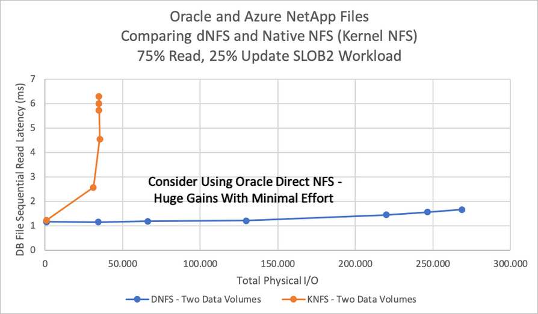

# Benefits of using Azure NetApp Files with Oracle Database

Oracle Direct NFS (dNFS) makes it possible to drive higher performance than the operating system's own NFS driver. This article explains the technology and provides a performance comparison between dNFS and the traditional NFS client (Kernel NFS). It also shows the advantages and the ease of using dNFS with Azure NetApp Files.  

[!INCLUDE [Oracle dNFS warning](./includes/oracle-dnfs.md)]

## How Oracle Direct NFS works

The following summary explains how Oracle Direct NFS works at a high level:

* Oracle Direct NFS bypasses the operating system buffer cache. Data is cached only once in the user space, eliminating the overhead of memory copies.  

* The traditional NFS client uses a single network flow as shown below:    

    

    Oracle Direct NFS further improves performance by load-balancing network traffic across multiple network flows. As tested and shown below, 650 distinct network connections were established dynamically by the Oracle Database:  

    

The [Oracle FAQ for Direct NFS](http://www.orafaq.com/wiki/Direct_NFS) shows that Oracle dNFS is an optimized NFS client. It provides fast and scalable access to NFS storage that is located on NAS storage devices (accessible over TCP/IP). dNFS is built into the database kernel just like ASM, which is used primarily with DAS or SAN storage. As such, *the guideline is to use dNFS when implementing NAS storage and use ASM when implementing SAN storage.*

dNFS is the default option in Oracle 18c.

dNFS is available starting with Oracle Database 11g. The diagram below compares dNFS with native NFS. When you use dNFS, an Oracle database that runs on an Azure virtual machine can drive more I/O than the native NFS client.

You can enable or disable dNFS by running two commands and restarting the database.

To enable:  
`cd $ORACLE_HOME/rdbms/lib ; make -f ins_rdbms.mk dnfs_on`

To disable:  
`cd $ORACLE_HOME/rdbms/lib ; make -f ins_rdbms.mk dnfs_off`

## Azure NetApp Files combined with Oracle Direct NFS

You can enhance the performance of Oracle dNFS with the Azure NetApp Files service. The service gives you total control over your application performance. It can meet extremely demanding applications. The combination of Oracle dNFS with Azure NetApp Files provides great advantage to your workloads.

## Next steps

- [Solution architectures using Azure NetApp Files](azure-netapp-files-solution-architectures.md)
- [Overview of Oracle Applications and solutions on Azure](/azure/virtual-machines/workloads/oracle/oracle-overview)
