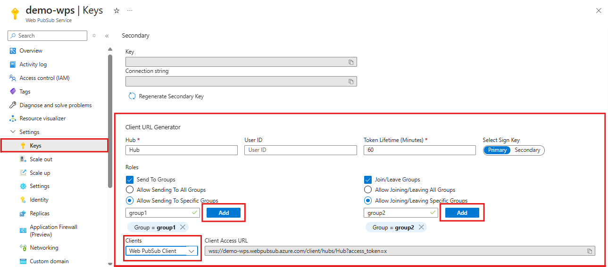

# Publish/subscribe among clients
:::image type="content" source="media/quickstarts-pubsub-among-clients/among-clients.gif" alt-text="GIF of pub/sub among clients without an application server.":::

This quickstart guide demonstrates how to
> [!div class="checklist"]
> * **connect** to your Web PubSub resource
> * **subscribe** to messages from groups
> * **publish** messages to groups

## Prerequisites
- A Web PubSub resource. If you haven't created one, you can follow the guidance: [Create a Web PubSub resource](./howto-develop-create-instance.md)
- A code editor, such as Visual Studio Code
- Install the dependencies for the language you plan to use 

## Install the client SDK

> [!NOTE] 
> This guide uses the client SDK provided by Web PubSub service, which is still in preview. The interface may change in later versions.

# [JavaScript](#tab/javascript)

```bash
mkdir pubsub_among_clients
cd pubsub_among_clients

# The SDK is available as an NPM module.
npm install @azure/web-pubsub-client
```

# [C#](#tab/csharp)

```bash
mkdir pubsub_among_clients
cd pubsub_among_clients

# Create a new .net console project
dotnet new console

# Install the client SDK, which is available as a NuGet package
dotnet add package Azure.Messaging.WebPubSub.Client --prerelease
```
---

## Connect to Web PubSub

A client, be it a browser 💻, a mobile app 📱, or an IoT device 💡, uses a **Client Access URL** to connect and authenticate with your resource. This URL follows a pattern of `wss://<service_name>.webpubsub.azure.com/client/hubs/<hub_name>?access_token=<token>`. A client can have a few ways to obtain the Client Access URL. For this quick start, you can copy and paste one from Azure portal shown in the following diagram. It's best practice to not hard code the Client Access URL in your code. In the production world, we usually set up an app server to return this URL on demand. [Generate Client Access URL](./howto-generate-client-access-url.md) describes the practice in detail.



As shown in the diagram above, the client has the permissions to send messages to and join a specific group named `group1`.

# [JavaScript](#tab/javascript)

Create a file with name `index.js` and add following code

```javascript
const { WebPubSubClient } = require("@azure/web-pubsub-client");

// Instantiate the client object. 
// <client-access-url> is copied from Azure portal mentioned above.
const client = new WebPubSubClient("<client-access-url>");
```

# [C#](#tab/csharp)

Edit the `Program.cs` file and add following code

```csharp
using Azure.Messaging.WebPubSub.Clients;

// Instantiate the client object. 
// <client-access-uri> is copied from Azure portal mentioned above.
var client = new WebPubSubClient(new Uri("<client-access-uri>"));
```
---

## Subscribe to a group

To receive messages from groups, the client
- must join the group it wishes to receive messages from
- has a callback to handle `group-message` event
  
The following code shows a client subscribes to messages from a group named `group1`.

# [JavaScript](#tab/javascript)

```javascript
// ...code from the last step

// Provide callback to the "group-message" event. 
client.on("group-message", (e) => {
  console.log(`Received message: ${e.message.data}`);
});

// Before joining group, you must invoke start() on the client object.
client.start();

// Join a group named "group1" to subscribe message from this group.
// Note that this client has the permission to join "group1", 
// which was configured on Azure portal in the step of generating "Client Access URL".
client.joinGroup("group1");
```

# [C#](#tab/csharp)

```csharp
// ...code from the last step

// Provide callback to group messages.
client.GroupMessageReceived += eventArgs =>
{
    Console.WriteLine($"Receive group message from {eventArgs.Message.Group}: {eventArgs.Message.Data}");
    return Task.CompletedTask;
};

// Before joining group, you must invoke start() on the client object.
await client.StartAsync();

// Join a group named "group1" to subscribe message from this group.
// Note that this client has the permission to join "group1", 
// which was configured on Azure portal in the step of generating "Client Access URL".
await client.JoinGroupAsync("group1");
```
---

## Publish a message to a group
In the previous step, we've set up everything needed to receive messages from `group1`, now we send messages to that group. 

# [JavaScript](#tab/javascript)

```javascript
// ...code from the last step

// Send message "Hello World" in the "text" format to "group1".
client.sendToGroup("group1", "Hello World", "text");
```

# [C#](#tab/csharp)

```csharp
// ...code from the last step

// Send message "Hello World" in the "text" format to "group1".
await client.SendToGroupAsync("group1", BinaryData.FromString("Hello World"), WebPubSubDataType.Text);
```
---

## Next steps
By using the client SDK, you now know how to 
> [!div class="checklist"]
> * **connect** to your Web PubSub resource
> * **subscribe** to group messages
> * **publish** messages to groups

Next, you learn how to **push messages in real-time** from an application server to your clients.
> [!div class="nextstepaction"]
> [Push message from application server](quickstarts-push-messages-from-server.md)
