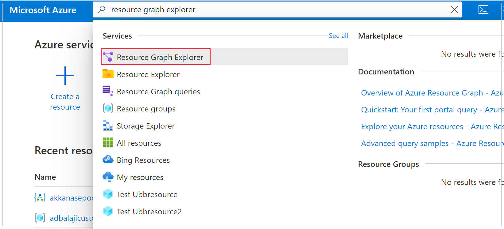
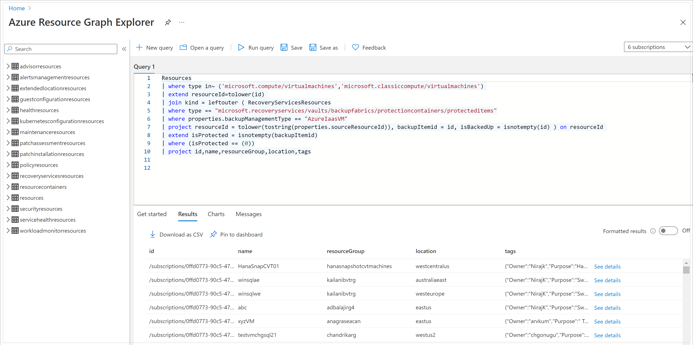

# Query your backups using Azure Resource Graph (ARG)

You can query information on backup for your Azure resources at no additional cost using [Azure Resource Graph (ARG)](../governance/resource-graph/overview.md). ARG is an Azure service designed to extend Azure Resource Management. It aims to provide efficient resource exploration with the ability to query at scale across a given set of subscriptions. Following are the key benefits of using ARG to query your backup metadata:

- Abilities to query resources at-scale with complex filtering, grouping, and sorting by resource properties.
- Ability to obtain real-time information on your backups, including in-progress backup jobs.
- Ability to join backup-related data with useful information on related Azure resources, such as Azure Virtual Machines and Storage Accounts.

## Getting started

To get started with querying your backups using ARG, follow these steps:

1. Search for _Resource Graph Explorer_ in the Azure portal. Select the same to get redirected to the ARG query editor.
    
    

    The left pane displays all tables (and their associated schemas) that are available for query.
    
    - The **RecoveryServicesResources** table contains most of the backup-related records, such as job details, backup instance details.  and so on.
    - The **Resources** table contains information on all top-level Azure Resources, such as Recovery Services vaults, Azure Virtual Machines, Storage Accounts, and so on.

    

1. To explore the data in any of these tables, write **Kusto** queries in the query editor and click **Run Query**.

    You can download the output of these queries as CSV from the **Resource Graph Explorer**. You can also use these queries in custom automation using any automation clients supported by ARG, such as [PowerShell](../governance/resource-graph/first-query-powershell.md), [CLI](../governance/resource-graph/first-query-azurecli.md), or [SDK](../governance/resource-graph/first-query-python.md). You can also create [custom workbooks](/azure/azure-monitor/visualize/workbooks-overview) in the Azure portal using ARG as a data source.

>[!NOTE] 
>- Backup/Restore jobs that are up to 14 days old are available in ARG for query. If you want to query historical records, we recommend you to use **Azure Monitor Logs**.
>- ARG allows you to query the resources for which you have the appropriate RBAC rights.

## Sample queries

The following are some sample ARG queries on your backup data that you can use in custom dashboards and automations.

### List all Azure VMs that have been configured for backup

```kusto
RecoveryServicesResources 
| where type in~ ('Microsoft.RecoveryServices/vaults/backupFabrics/protectionContainers/protectedItems')
| extend vaultName = case(type =~ 'microsoft.dataprotection/backupVaults/backupInstances',split(split(id, '/Microsoft.DataProtection/backupVaults/')[1],'/')[0],type =~ 'Microsoft.RecoveryServices/vaults/backupFabrics/protectionContainers/protectedItems',split(split(id, '/Microsoft.RecoveryServices/vaults/')[1],'/')[0],'--')
| extend dataSourceType = case(type=~'Microsoft.RecoveryServices/vaults/backupFabrics/protectionContainers/protectedItems',properties.backupManagementType,type =~ 'microsoft.dataprotection/backupVaults/backupInstances',properties.dataSourceSetInfo.datasourceType,'--')
| extend friendlyName = properties.friendlyName
| extend dsResourceGroup = split(split(properties.dataSourceInfo.resourceID, '/resourceGroups/')[1],'/')[0]
| extend dsSubscription = split(split(properties.dataSourceInfo.resourceID, '/subscriptions/')[1],'/')[0]
| extend lastRestorePoint = properties.lastRecoveryPoint
| extend primaryLocation = properties.dataSourceInfo.resourceLocation
| extend policyName = case(type =~ 'Microsoft.RecoveryServices/vaults/backupFabrics/protectionContainers/protectedItems',properties.policyName, type =~ 'microsoft.dataprotection/backupVaults/backupInstances', properties.policyInfo.name, '--')
| extend protectionState = properties.currentProtectionState
| where protectionState in~ ('ConfiguringProtection','ProtectionConfigured','ConfiguringProtectionFailed','ProtectionStopped','SoftDeleted','ProtectionError')

```

### List all backup jobs on Azure Databases for PostgreSQL Servers in the last one week

```kusto
RecoveryServicesResources 
| where type in~ ('Microsoft.DataProtection/backupVaults/backupJobs')
| extend vaultName = case(type =~ 'microsoft.dataprotection/backupVaults/backupJobs',properties.vaultName,type =~ 'Microsoft.RecoveryServices/vaults/backupJobs',split(split(id, '/Microsoft.RecoveryServices/vaults/')[1],'/')[0],'--')
| extend friendlyName = case(type =~ 'microsoft.dataprotection/backupVaults/backupJobs',strcat(properties.dataSourceSetName , '/', properties.dataSourceName),type =~ 'Microsoft.RecoveryServices/vaults/backupJobs', properties.entityFriendlyName, '--')
| extend dataSourceType = case(type =~ 'Microsoft.RecoveryServices/vaults/backupJobs',properties.backupManagementType,type =~ 'microsoft.dataprotection/backupVaults/backupJobs',properties.dataSourceType,'--')
| extend backupInstanceName = properties.backupInstanceId
| extend dsResourceGroup = split(split(properties.dataSourceId, '/resourceGroups/')[1],'/')[0]| extend dsSubscription = split(split(properties.dataSourceId, '/subscriptions/')[1],'/')[0]
| extend status = properties.status
| extend dataSourceId = properties.dataSourceId
| extend primaryLocation = properties.dataSourceLocation
| extend jobStatus = case (properties.status == 'Completed' or properties.status == 'CompletedWithWarnings','Succeeded',properties.status == 'Failed','Failed',properties.status == 'InProgress', 'Started', properties.status), operation = case(type =~ 'microsoft.dataprotection/backupVaults/backupJobs' and tolower(properties.operationCategory) =~ 'backup' and properties.isUserTriggered == 'true',strcat('adhoc',properties.operationCategory),type =~ 'microsoft.dataprotection/backupVaults/backupJobs', tolower(properties.operationCategory), type =~ 'Microsoft.RecoveryServices/vaults/backupJobs' and tolower(properties.operation) =~ 'backup' and properties.isUserTriggered == 'true',strcat('adhoc',properties.operation),type =~ 'Microsoft.RecoveryServices/vaults/backupJobs',tolower(properties.operation), '--'),startTime = todatetime(properties.startTime),endTime = properties.endTime, duration = properties.duration
| project id, name, friendlyName, resourceGroup, vaultName, dataSourceType, operation, jobStatus, startTime, duration, backupInstanceName, dsResourceGroup, dsSubscription, status, primaryLocation, dataSourceId
| where (startTime >= ago(7d))

```

### List all Azure VMs that have not been configured for backup

```kusto
Resources
| where type in~ ('microsoft.compute/virtualmachines','microsoft.classiccompute/virtualmachines') 
| extend resourceId=tolower(id) 
| join kind = leftouter ( RecoveryServicesResources
| where type == "microsoft.recoveryservices/vaults/backupfabrics/protectioncontainers/protecteditems"
| where properties.backupManagementType == "AzureIaasVM"
| project resourceId = tolower(tostring(properties.sourceResourceId)), backupItemid = id, isBackedUp = isnotempty(id) ) on resourceId 
| extend isProtected = isnotempty(backupItemid)
| where (isProtected == (0))
| project id,name,resourceGroup,location,tags

```

### List all Backup policies used for Azure VMs

```kusto
RecoveryServicesResources
| where type == 'microsoft.recoveryservices/vaults/backuppolicies'
| extend vaultName = case(type == 'microsoft.recoveryservices/vaults/backuppolicies', split(split(id, 'microsoft.recoveryservices/vaults/')[1],'/')[0],type == 'microsoft.recoveryservices/vaults/backuppolicies', split(split(id, 'microsoft.recoveryservices/vaults/')[1],'/')[0],'--')
| extend datasourceType = case(type == 'microsoft.recoveryservices/vaults/backuppolicies', properties.backupManagementType,type == 'microsoft.dataprotection/backupVaults/backupPolicies',properties.datasourceTypes[0],'--')
| project id,name,vaultName,resourceGroup,properties,datasourceType
| where datasourceType == 'AzureIaasVM'
```

### List all VMs associated with a given backup policy

```kusto
RecoveryServicesResources
| where type == "microsoft.recoveryservices/vaults/backupfabrics/protectioncontainers/protecteditems"
| project propertiesJSON = parse_json(properties)
| where propertiesJSON.backupManagementType == "AzureIaasVM"
| project VMID=propertiesJSON.sourceResourceId, PolicyID=propertiesJSON.policyId
| where PolicyID == "<ARM ID of the given policy>"
```

### List all Backup policies used for Azure Databases for PostgreSQL Servers

```kusto
RecoveryServicesResources 
| where type in~ ('Microsoft.DataProtection/BackupVaults/backupPolicies')
| extend vaultName = case(type =~ 'microsoft.dataprotection/backupVaults/backupPolicies', split(split(id, '/Microsoft.DataProtection/backupVaults/')[1],'/')[0],type =~ 'microsoft.recoveryservices/vaults/backupPolicies', split(split(id, '/Microsoft.RecoveryServices/vaults/')[1],'/')[0],'--')
| extend datasourceType = case(type =~ 'Microsoft.RecoveryServices/vaults/backupPolicies', properties.backupManagementType,type =~ 'microsoft.dataprotection/backupVaults/backupPolicies',properties.datasourceTypes[0],'--')
| project id,name,vaultName,resourceGroup,properties,datasourceType
| where (datasourceType in~ ('Microsoft.DBforPostgreSQL/servers/databases'))

```

## Next steps

[Learn more about Azure Resource Graph](../governance/resource-graph/overview.md)