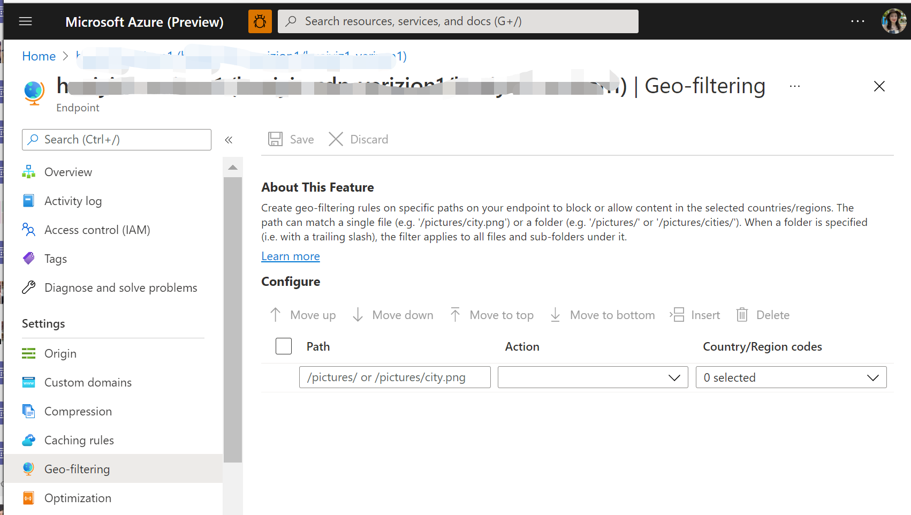

# Restrict Azure CDN content by country/region

[!INCLUDE [Azure CDN from Microsoft (classic) retirement notice](../../includes/cdn-classic-retirement.md)]

When a user requests your content, the content is served to users in all locations. You might want to restrict access to your content by country/region.

With the *geo-filtering* feature, you can create rules on specific paths on your CDN endpoint. You can set the rules to allow or block content in selected countries/regions.

> [!IMPORTANT]
> **Azure CDN Standard from Microsoft** profiles do not support path-based geo-filtering.
>

## Standard profiles

These instructions are for and **Azure CDN Standard from Edgio** profiles.

For **Azure CDN Premium from Edgio** profiles, you must use the **Manage** portal to activate geo-filtering. For more information, see [Azure CDN Premium from Edgio profiles](#azure-cdn-premium-from-verizon-profiles).

### Define the directory path

To access the geo-filtering feature, select your CDN endpoint within the portal, then select **Geo-filtering** under SETTINGS in the left-hand menu.

From the **PATH** box, specify the relative path to the location to which users are allowed or denied access.

You can apply geo-filtering for all your files with a forward slash (/) or select specific folders by specifying directory paths (for example, */pictures/*). You can also apply geo-filtering to a single file (for example */pictures/city.png*). Multiple rules are allowed. After you enter a rule, a blank row appears for you to enter the next rule.

For example, all of the following directory path filters are valid:

*/*

*/Photos/*

*/Photos/Strasbourg/*

*/Photos/Strasbourg/city.png*

### Define the type of action

From the **ACTION** list, select **Allow** or **Block**:

- **Allow:** Only users from the specified countries/regions are allowed access to assets requested from the recursive path.

- **Block:** Users from the specified countries/regions are denied access to the assets requested from the recursive path. If no other country/region filtering options have been configured for that location, then all other users are allowed access.

For example, a geo-filtering rule for blocking the path */Photos/Strasbourg/* filters the following files:

*http:\//\<endpoint>.azureedge.net/Photos/Strasbourg/1000.jpg*
*http:\//\<endpoint>.azureedge.net/Photos/Strasbourg/Cathedral/1000.jpg*

### Define the countries/regions

From the **COUNTRY/REGION CODES** list, select the countries/regions that you want to block or allow for the path.

After you have finished selecting the countries/regions, select **Save** to activate the new geo-filtering rule.

### Clean up resources

To delete a rule, select it from the list on the **Geo-filtering** page, then choose **Delete**.

## Azure CDN Premium from Edgio profiles

For **Azure CDN Premium from Edgio** profiles, the user interface for creating a geo-filtering rule is different:

1. From the top menu in your Azure CDN profile, select **Manage**.

2. From the Edgio portal, select **HTTP Large**, then select **Country Filtering**.

    :::image type="content" source="./media/cdn-filtering/cdn-geo-filtering-premium.png" alt-text="Screenshot shows how to select country filtering in Azure CDN" border="true":::

3. Select **Add Country Filter**.

4. In **Step One:**, enter the directory path. Select **Block** or **Add**, then select **Next**.

    > [!IMPORTANT]
    > The endpoint name must be in the path. Example: **/myendpoint8675/myfolder**. Replace **myendpoint8675** with the name of your endpoint.
    >

5. In **Step Two**, select one or more countries/regions from the list. Select **Finish** to activate the rule.

    The new rule appears in the table on the **Country Filtering** page.

    :::image type="content" source="./media/cdn-filtering/cdn-geo-filtering-premium-rules.png" alt-text="Screenshot shows where the rule appears in country filtering." border="true":::

### Clean up resources

In the country/region filtering rules table, select the delete icon next to a rule to delete it or the edit icon to modify it.

## Considerations

- Changes to your geo-filtering configuration don't take effect immediately:
   - For **Azure CDN Standard from Microsoft** profiles, propagation usually completes in 10 minutes.
   - For **Azure CDN Standard from Edgio** and **Azure CDN Premium from Edgio** profiles, propagation usually completes in 10 minutes.

- This feature doesn't support wildcard characters (for example, *).

- The geo-filtering configuration associated with the relative path is applied recursively to that path.

- Only one rule can be applied to the same relative path. That is, you can't create multiple country/region filters that point to the same relative path. However, because country/region filters are recursive, a folder can have multiple country/region filters. In other words, a subfolder of a previously configured folder can be assigned a different country/region filter.

- The geo-filtering feature uses [country/region codes](microsoft-pop-abbreviations.md) codes to define the countries/regions from which a request is allowed or blocked for a secured directory. **Azure CDN from Edgio** use ISO 3166-1 alpha-2 country codes to define the countries/regions from which a request are allowed or blocked for a secured directory.
