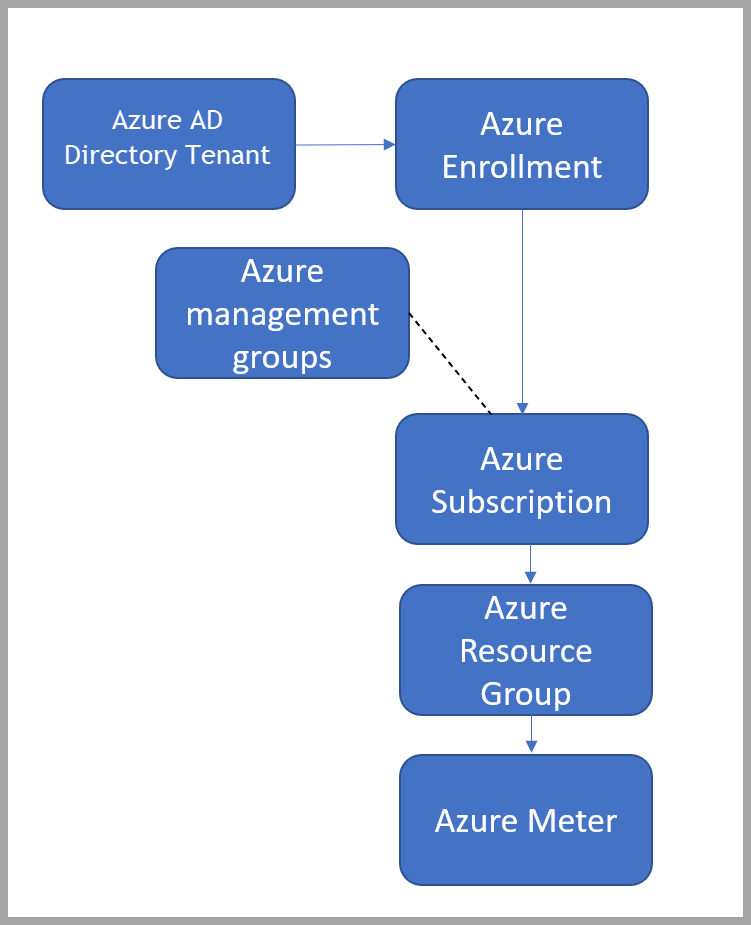

# Security within Azure Dev/Test Subscription

Keeping your resources safe is a joint effort between your cloud provider, Azure, and you. Azure Dev/Test Subscriptions and the [Microsoft Defender for Cloud](../../security-center/security-center-introduction.md) provide you with the tools needed to harden your network, secure your services, and make sure you're on top of your security posture.  

Important tools within Azure Dev/Test Subscriptions help you create secure access to your resources:  

- Azure Management Groups  
- Azure Lighthouse  
- Credits Monitoring  
- Microsoft Entra ID  

## Azure Management Groups  

When you enable and set up your Azure Dev/Test Subscriptions, Azure deploys a default resource hierarchy to manage identities and access to resources in a single Microsoft Entra domain. The resource hierarchy allows your organization to set up strong security perimeters for your resources and users.  

  

Your resources, resource groups, subscriptions, management groups, and tenant collectively make up your resource hierarchy. Updating and changing these settings in Azure custom roles or Azure policy assignments can affect every resource in your resource hierarchy. It's important to protect the resource hierarchy from changes that could negatively affect all resources.  

[Azure Management Groups](../../governance/management-groups/overview.md) are an important aspect of governing access and protecting your resources in a single tenant. Azure Management Groups allows you to set quotas, Azure policies, and security to different types of subscriptions. These groups are a vital component of developing security for your organization's dev/test subscriptions.  

As you can see, using management groups changes the default hierarchy and adds a level for the management groups. This behavior can potentially create unforeseen circumstances and holes in security if you don’t follow the [appropriate process to protect your resource hierarchy](../../governance/management-groups/how-to/protect-resource-hierarchy.md)  

## Why are Azure Management Groups useful?  

When developing security policies for your organization's dev/test subscriptions, you might choose to have multiple dev/test subscriptions per organizational unit or line of business. You can see a visual of that management grouping in the following diagram.  

  

You might also choose to have one dev/test subscription for all of your different units.  

Your Azure Management Groups and dev/test subscriptions act as a security barrier within your organizational structure.  

This security barrier has two components:  

- Identity and access: You might need to segment access to specific resources  
- Data: Different subscriptions for resources that access personal information  

## Using Microsoft Entra tenants  

[A tenant](../../active-directory/develop/quickstart-create-new-tenant.md) is a dedicated instance of Microsoft Entra ID that an organization or app developer receives when the organization or app developer creates a relationship with Microsoft like signing up for Azure, Microsoft Intune, or Microsoft 365.  

Each Microsoft Entra tenant is separate from other Microsoft Entra tenants. Each Microsoft Entra tenant has its own representation of work and school identities, consumer identities (if it's an Azure AD B2C tenant), and app registrations. An app registration inside your tenant can allow authentications from accounts only within your tenant or all tenants.  

If you need to further separate your organization’s identity infrastructure beyond management groups within a single tenant, you can also create another tenants with its own resource hierarchy.  

An easy way to do separate resources and users is creating a new Microsoft Entra tenant.  

### Create a new Microsoft Entra tenant  

If you don't have a Microsoft Entra tenant, or want to create a new one for development, see the [quick start guide](../../active-directory/fundamentals/active-directory-access-create-new-tenant.md) or follow the [directory creation experience](https://portal.azure.com/#create/Microsoft.AzureActiveDirectory). You have to provide the following info to create your new tenant:  

- **Organization name**  
- **Initial domain** - is part of /*.onmicrosoft.com. You can customize the domain later.  
- **Country or region**  

 [Learn more about creating and setting up Microsoft Entra tenants](../../active-directory/develop/quickstart-create-new-tenant.md)  

### Using Azure Lighthouse to manage multiple tenants  

Azure Lighthouse enables cross- and multitenant management, allowing for higher automation, scalability, and enhanced governance across resources and tenants. Service providers can deliver managed services using comprehensive and robust management tooling built into the Azure platform. Customers maintain control over who accesses their tenant, which resources they access, and what actions can be taken.  

A common scenario for Azure Lighthouse is managing resources in its customers’ Microsoft Entra tenants. However, the capabilities of Azure Lighthouse can also be used to simplify cross-tenant management within an enterprise that uses multiple Microsoft Entra tenants.  

For most organizations, management is easier with a single Microsoft Entra tenant. Having all resources within one tenant allows centralization of management tasks by designated users, user groups, or service principals within that tenant.  

Where a multitenant architecture is required, Azure Lighthouse helps centralize and streamline management operations. By using Azure delegated resource management, users in one managing tenant can perform cross-tenant management functions in a centralized, scalable manner.  

[More Security Resources](../../security-center/security-center-introduction.md)
