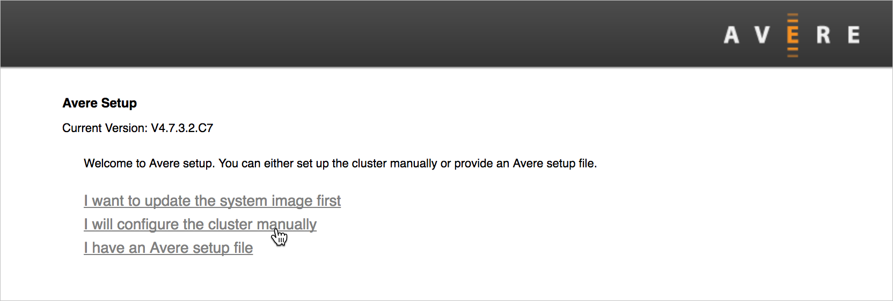
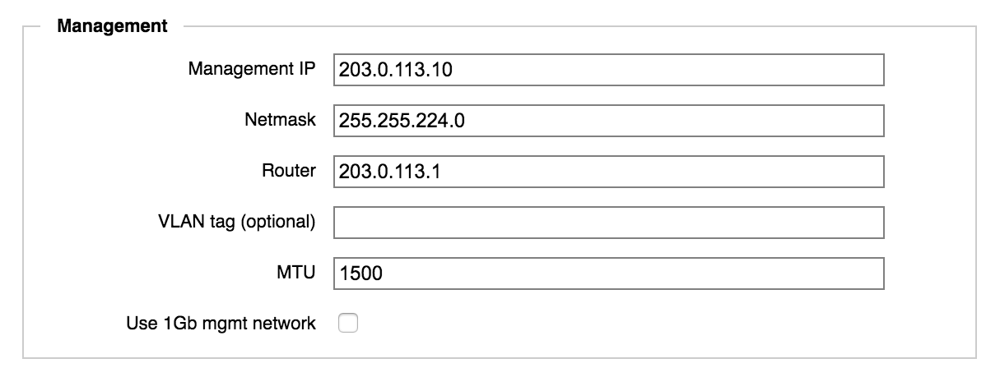
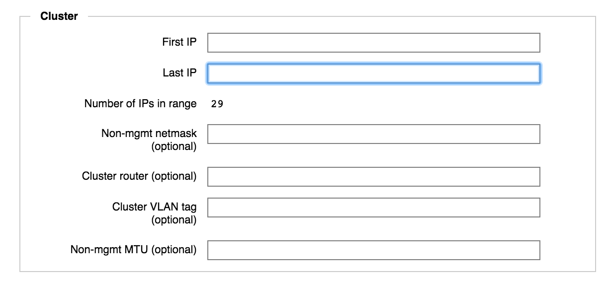
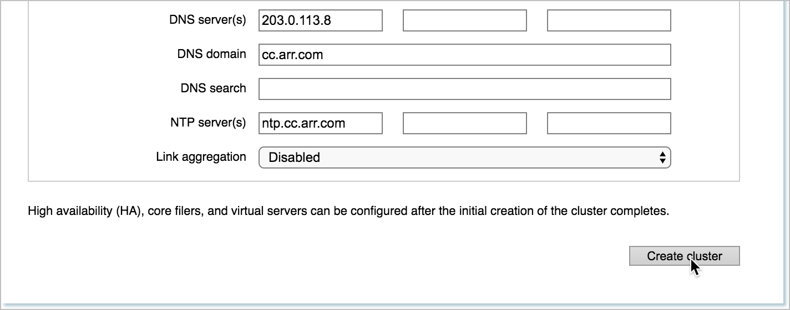
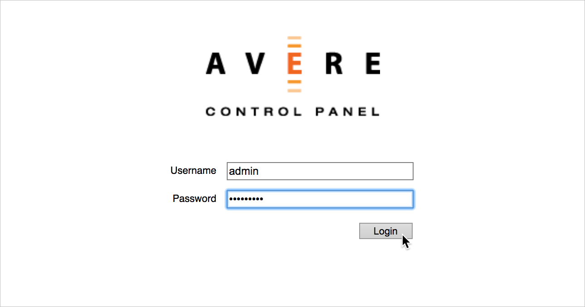
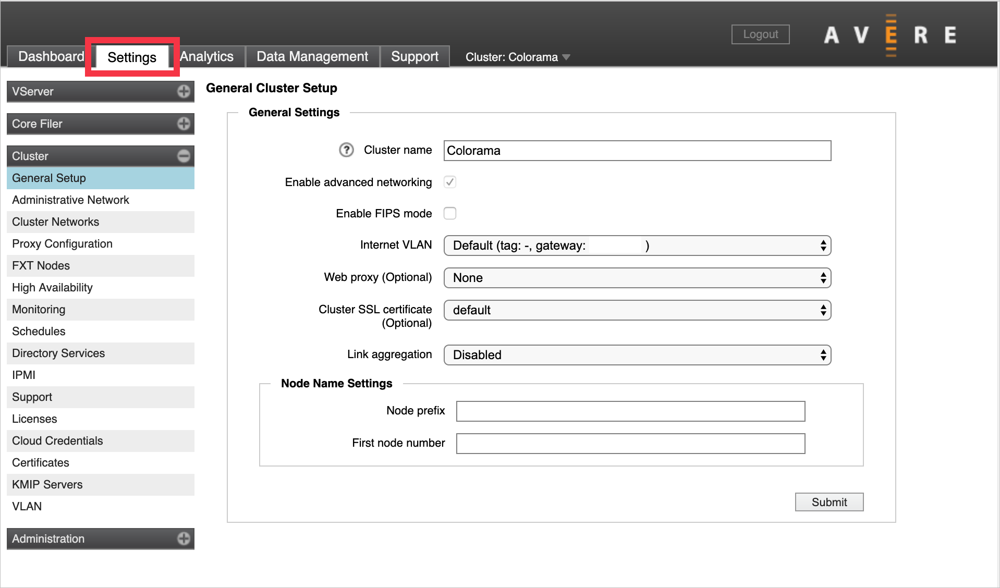
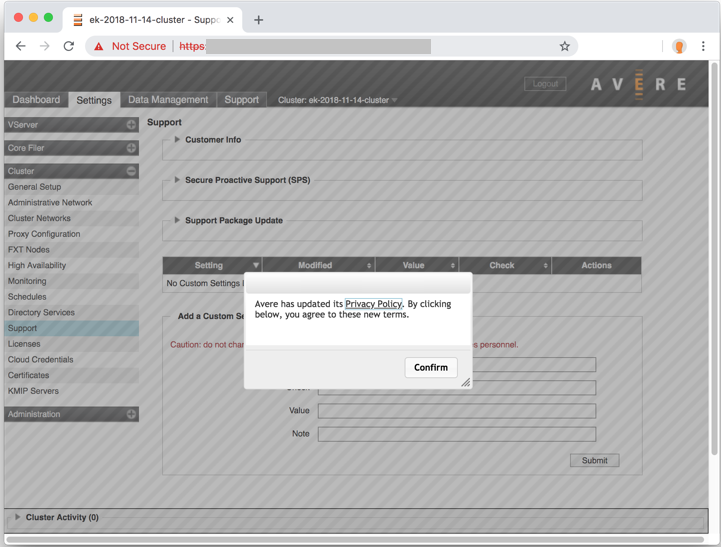

# Tutorial: Create the Azure FXT Edge Filer cluster

After you install and initialize the Azure FXT Edge Filer hardware nodes for your cache, use the FXT cluster software to create the cache cluster.

This tutorial walks you through the steps to configure your hardware nodes as a cluster.

In this tutorial, you will learn:

> [!div class="checklist"]
>
> * What information is needed before starting to create the cluster
> * The difference between the cluster's management network, the cluster network, and the client-facing network
> * How to connect to a cluster node
> * How to create an initial cluster using one Azure FXT Edge Filer node
> * How to sign in to the cluster control panel to configure the cluster settings

This procedure takes between 15 and 45 minutes, depending on how much research you need to do to identify IP addresses and network resources.

## Prerequisites

Complete these prerequisites before starting this tutorial:

* Install your Azure FXT Edge Filer hardware systems in your data center

  You only need one node to create the cluster, but you need to [add at least two more nodes](add-nodes.md) before you can configure the cluster and get it ready to use.

* Connect appropriate power and network cables to the system  
* Power on at least one Azure FXT Edge Filer node and [set its root password](node-password.md)

## Gather information for the cluster

You need the following information to create the Azure FXT Edge Filer cluster:

* Cluster name

* Administrative password to set for the cluster

* IP addresses:

  * A single IP address for cluster management, and the netmask and router to use for the management network
  * The first and last IP addresses in a contiguous range of IP addresses for cluster (node to node) communication. See [IP address distribution](#ip-address-distribution), below, for details.
  * (Client-facing IP addresses are set after cluster creation.)

* Network infrastructure information:

  * The IP address of a DNS server for the cluster
  * The name of the DNS domain for the cluster
  * The name or IP address for the cluster NTP servers (either one server or three or more)
  * Whether you want to enable IEEE 802.1AX-2008 link aggregation on the cluster’s interfaces
  * If you enable link aggregation, whether or not to use IEEE 802.3ad (LACP) dynamic aggregation

You can configure these network infrastructure items after you create the cluster, but it is better to do it at creation time.

### IP address distribution

The Azure FXT Edge Filer hybrid storage cache cluster uses IP addresses in three categories:

* Management IP: A single IP address for cluster management

  This address serves as the entry point to access the cluster configuration utilities (the web-based control panel or the XML-RPC API). This address is automatically assigned to the primary node in the cluster, and it moves automatically if the primary node changes.

  Other IP addresses can be used to access the control panel, but the management IP address is designed to provide access even if individual nodes fail over.

* Cluster Network: A range of IP addresses for cluster communication

  The cluster network is used for communication among cluster nodes and to retrieve files from the backend storage (core filers).

  **Best practice:** Allocate one IP address per physical port used for cluster communication on each Azure FXT Edge Filer node. The cluster automatically assigns the addresses in the specified range to individual nodes.

* Client-facing network: The range of IP addresses that clients use to request and write files

  The client network addresses are used by clients to access the core filer data through the cluster. For example, an NFS client might mount one of these addresses.

  **Best practice:** Allocate one IP address per physical port used for client communication on each FXT Series node.

  The cluster distributes client-facing IP addresses across its constituent nodes as evenly as possible.

  For simplicity, many administrators configure a single DNS name with round-robin DNS (RRDNS) configuration to make it easier to distribute client requests across the address range. This setup also enables all clients to use the same mount command to access the cluster. Read [Configure DNS](configure-network.md#configure-dns-for-load-balancing) for more information.

The management IP address and a range of cluster network addresses must be specified to create a new cluster. Client-facing addresses are specified after cluster creation.

## Connect to the first node

You can connect to any of the installed FXT nodes and use its OS software to set up the cluster.

If you have not already done so, power on at least one of the FXT nodes for your cluster, and make sure it has a network connection and an IP address. You must set a new root password to activate the node, so follow the steps in [Set hardware passwords](node-password.md) if you have not already done so.

To check the network connection, make sure that the node’s network link LEDs are illuminated (and, if necessary, the indicators on the network switch to which it is attached). Indicator LEDs are described in [Monitor Azure FXT Edge Filer hardware status](monitor.md).

When the node boots, it will request an IP address. If it is connected to a DHCP server, it accepts the IP address provided by DHCP. (This IP address is temporary. It will change when you create the cluster.)

If it is not connected to a DHCP server or does not receive a response, the node will use Bonjour software to set a self-assigned IP address in the form 169.254.\*.\*. However, you should set a temporary static IP address on one of the node’s network cards before using it to create a cluster. Instructions are included in this legacy document; contact Microsoft Service and Support for updated information: [Appendix A: Setting a Static IP Address on an FXT Node](https://azure.github.io/Avere/legacy/create_cluster/4_8/html/static_ip.html).

### Find the IP address

Connect to the Azure FXT Edge Filer node to find its IP address. You can use a serial cable, direct connection to the USB and VGA ports, or connect through a KVM switch. (For port connection details see [Set initial passwords](node-password.md).)

After you connect, sign in with the username `root` and the password that you set when you booted the node for the first time.

After signing in, you need to determine the node’s IP address.

Use the command `ifconfig` to see the addresses assigned to this system.

For example, the command `ifconfig | grep -B5 inet` searches for ports with internet addresses and gives five lines of context to show the port identifier.

Write down any IP address shown in the ifconfig report. Addresses listed with port names like e0a or e0b are good options. Do not use any IP addresses listed with e7* names, since those names are only used for iDRAC/IPMI service ports.

## Load the cluster configuration wizard

Use the browser-based cluster configuration tool to create the cluster.

Enter the IP address for the node in a web browser. If the browser gives a message about the site being untrusted, proceed to the site anyway. (Individual Azure FXT Edge Filer nodes do not have CA-provided security certificates.)

Leave the **Username** and **Password** fields blank. Click **Login** to load the cluster creation page.

## Create the cluster

The cluster configuration tool guides you through a set of screens to create the Azure FXT Edge Filer cluster. Make sure you have the [required information](#gather-information-for-the-cluster) ready before starting.

### Creation options

The first screen gives three options. Use the manual configuration option unless you have special instructions from support staff.

Click **I will configure the cluster manually** to load the new cluster configuration options screen.

The other options are rarely used:

* "Update the system image" prompts you to install new OS software before creating the cluster. (The currently installed software version is listed at the top of the screen.) You must provide the software package file - either a URL and username/password, or by uploading a file from your computer.

* The cluster setup file option is sometimes used by Microsoft Customer Service and Support.

## Cluster options

The next screen prompts you to configure options for the new cluster.

The page is divided into two main sections, **Basic Configuration** and **Networking Configuration**. The networking configuration section also has subsections: one for the **Management** network and one for the **Cluster** network.

### Basic configuration

In the top section, fill in basic information for the new cluster.

* **Cluster Name** - Enter a unique name for the cluster.

  The cluster name must meet these criteria:
  
  * Length of 1 to 16 characters
  * Can include letters, numbers, and the dash (-) and underscore (_) characters
  * Must not include other punctuation or special characters
  
  You can change this name later on the **Cluster** > **General Setup** configuration page. (For more information about cluster settings, read the [Cluster Configuration Guide](https://azure.github.io/Avere/legacy/ops_guide/4_7/html/ops_conf_index.html), which is not part of this documentation set.)

  > [!NOTE]
  > Your cluster name is used to identify system information uploaded to support for monitoring or troubleshooting, so it's helpful to include your company name.

* **Admin password** - Set the password for the default administrative user, `admin`.
  
  You should set up individual user accounts for each person who administers the cluster, but you cannot remove the user `admin`. Sign in as `admin` if you need to create additional users.

  You can change the password for `admin` in the **Administration** > **Users** settings page in the cluster Control Panel. For details, read the **Users** documentation in the [Cluster Configuration Guide](https://azure.github.io/Avere/legacy/ops_guide/4_7/html/gui_users.html).

<!-- to do: update "legacy" URLs when docs are ported to Microsoft site -->

### Network configuration

The **Networking** section prompts you to specify the network infrastructure that the cluster will use.

There are two separate networks to configure:

* The *management network* provides administrator access to the cluster for configuration and monitoring. The IP address specified here is used when connecting to the Control Panel or for SSH access.

  Most clusters use only a single management IP address, but if you want to add interfaces you can do so after creating the cluster.

* The *cluster network* is used for communication among cluster nodes and between cluster nodes and back-end storage (core filers).

The client-facing network is configured later, after the cluster has been created.

This section also includes configuration for DNS and NTP servers that are used by both networks.

### Configure the management network

Settings in the **Management** section are for the network that provides administrator access to the cluster.

* **Management IP** - Specify the IP address that you will use to access the cluster Control Panel. This address will be claimed by the cluster’s primary node, but it automatically moves to a healthy node if the original primary node becomes unavailable.

  Most clusters use only one management IP address. If you want more than one, you can add them after you create the cluster by using the  **Cluster** > **Administrative Network** settings page. Read more in the [Cluster Configuration Guide](https://azure.github.io/Avere/legacy/ops_guide/4_7/html/gui_admin_network.html).

* **Netmask** - Specify the netmask for the management network.

* **Router** - Enter the default gateway address used by the management network.

* **VLAN tag (optional)** - If your cluster uses VLAN tags, specify the tag for the management network.

  Additional VLAN settings are configured in the **Cluster** > **VLAN** settings page. Read [Working with VLANs](https://azure.github.io/Avere/legacy/ops_guide/4_7/html/network_overview.html#vlan-overview) and [Cluster > VLAN](https://azure.github.io/Avere/legacy/ops_guide/4_7/html/gui_vlan.html) in the Cluster Configuration Guide to learn more.

* **MTU** - If necessary, adjust the maximum transmission unit (MTU) for your cluster’s management network.

* **Use 1Gb mgmt network** - Check this box if you want to assign the two 1GbE network ports on your FXT nodes to the management network only. (You must have 25GbE/10GbE ports available for all other traffic.) If you don't check this box, the management network uses the highest speed port available.

### Configure the cluster network

The cluster network settings apply to traffic among the cluster nodes, and between cluster nodes and core filers.

* **First IP** and **Last IP** - Enter the IP addresses that define the range to use for internal cluster communication. The IP addresses used here must be contiguous and not assigned by DHCP.

  You can add more IP addresses after creating the cluster. Use the **Cluster** > **Cluster Networks** settings page ([Cluster Configuration Guide documentation](https://azure.github.io/Avere/legacy/ops_guide/4_7/html/gui_cluster_networks.html#gui-cluster-networks)).

  The value in **Number of IPs in Range** is calculated and shown automatically.

* **Non-mgmt netmask (optional)** - Specify the netmask for the cluster network.

  The system automatically suggests the netmask value that you entered for the management network; change it if needed.

* **Cluster router (optional)** - Specify the default gateway address used by the cluster network.

  The system automatically suggests the same gateway address that you supplied for the management network.

* **Cluster VLAN tag (optional)** - If your cluster uses VLAN tags, specify the tag for the cluster network.

* **Non-mgmt MTU (optional)** - If necessary, adjust the maximum transmission unit (MTU) for your cluster network.

### Configure cluster DNS and NTP

Below the **Cluster** section there are fields for specifying DNS and NTP servers, and for enabling link aggregation. These settings apply to all networks that the cluster uses.

* **DNS server(s)** - Enter the IP address of one or more domain name system (DNS) servers.

  DNS is recommended for all clusters, and required if you want to use SMB, AD, or Kerberos.
  
  For optimal performance, configure the cluster’s DNS server for round-robin load balancing as described in [Configure DNS for the Azure FXT Edge Filer cluster](configure-network.md#configure-dns-for-load-balancing).

* **DNS domain** - Enter the network domain name the cluster will use.

* **DNS search** - Optionally, enter additional domain names that the system should search to resolve DNS queries. You can add up to six domain names, separated by spaces.

* **NTP server(s)** - Specify either one or three network time protocol (NTP) servers in the fields provided. You can use hostnames or IP addresses.

* **Link aggregation** - Link aggregation allows you to customize how the ethernet ports on the cluster FXT nodes handle various types of traffic. To learn more, read [Link Aggregation](https://azure.github.io/Avere/legacy/ops_guide/4_7/html/gui_cluster_general_setup.html#link-aggregation) in the Cluster Configuration Guide.

### Click the create button

After supplying all the required settings in the form, click the **Create Cluster** button.

The system displays a message while creating the cluster.

After a few moments, you can click the link in the message to go to the cluster Control Panel. (This link takes you to the IP address that you specified in **Management IP**.) It takes 15 seconds to one minute for the link to become active after you click the create button. If the web interface does not load, wait several more seconds and then click the link again.

Cluster creation takes a minute or more, but you can sign in to the Control Panel while the process is going on. It is normal for the control panel's dashboard page to show warnings until the cluster creation process finishes.

## Open the Settings pages

After you create the cluster, you need to customize its configuration for your network and workflow.

Use the Control Panel web interface to set up your new cluster. Follow the link from your cluster creation status screen, or browse to the management IP address that you set on the cluster.

Sign in to the web interface with the username `admin` and the password that you set when creating the cluster.

The Control Panel opens and shows the **Dashboard** page. As the cluster creation finishes, any warning messages should clear from the display.

Click the **Settings** tab to configure the cluster.

On the **Settings** tab, the left sidebar shows a menu of configuration pages. The pages are organized by category. Click the + or - control at the top of the category name to expand or hide the individual pages.

## Cluster setup steps

At this point in the process, your cluster exists, but it has only one node, no client-facing IP addresses, and no back-end storage. Additional setup steps are needed to go from a newly created cluster to a cache system that is ready to handle your workflow.

### Required configuration

These steps are needed for most or all clusters.

* Add nodes to the cluster

  Three nodes is standard, but many production clusters have more - up to a maximum of 24 nodes.

  Read [Add cluster nodes](add-nodes.md) to learn how to add other Azure FXT Edge Filer units to your cluster, and to enable High Availability.

* Specify back-end storage

  Add *core filer* definitions for each back-end storage system that the cluster will use. Read [Add back-end storage and configure virtual namespace](add-storage.md#about-back-end-storage) to learn more.

* Set up client access and the virtual namespace

  Create at least one virtual server (vserver) and assign it an IP address range for client machines to use. You also must configure the cluster namespace (sometimes called the Global Namespace or GNS), a virtual filesystem feature that lets you map back-end storage exports to virtual paths. The cluster namespace gives clients a consistent and accessible filesystem structure even if you switch back-end storage media. The namespace also can provide a user-friendly virtual storage hierarchy for Azure Blob containers or other supported cloud object storage.

  Read [Configure the namespace](add-storage.md#configure-the-namespace) for details. This step includes:
  * Creating vservers
  * Setting up junctions between the client network view and back-end storage
  * Defining which client IP addresses are served by each vserver

  > [!Note]
  > Significant planning is recommended before starting to set up the cluster’s GNS. Read the [Using a Global Namespace](https://azure.github.io/Avere/legacy/ops_guide/4_7/html/gns_overview.html) and [Creating and Working with VServers](https://azure.github.io/Avere/legacy/ops_guide/4_7/html/settings_overview.html#creating-and-working-with-vservers) sections in the Cluster Configuration Guide for help.

* [Adjust network settings](configure-network.md)

  There are several network-related settings that should be verified or customized for a new cluster. Read [Adjust network settings](configure-network.md) for details about these items:

  * Verifying DNS and NTP configuration
  * Configuring directory services, if needed
  * Setting up VLANs
  * Configuring proxy servers
  * Adding IP addresses to the cluster network
  * Storing encryption certificates

* [Set up support monitoring](#enable-support)

  You must accept the privacy policy for the configuration tool, and you should configure your support upload settings at the same time.

  The cluster can automatically upload troubleshooting data about your cluster, including statistics and debugging files. These uploads let Microsoft Customer Service and Support provide the best possible service. You can customize what is monitored, and optionally enable the proactive support and remote troubleshooting service.  

### Optional configuration

These steps are not required for all clusters. They are needed for some types of workflows or for certain cluster management styles.

* Customize node settings

  You can set node names and configure node IPMI ports on a cluster-wide level, or individually. If you configure these settings before adding nodes to the cluster, the new nodes can pick up the settings automatically when they join. The options are described in the legacy cluster creation document [Customizing Node Settings](https://azure.github.io/Avere/legacy/create_cluster/4_8/html/config_node.html).

  > [!TIP]
  > Some documentation for this product is not yet available on the Microsoft Azure documentation site. Links to the [Cluster Configuration Guide](https://azure.github.io/Avere/legacy/ops_guide/4_7/html/ops_conf_index.html) and the legacy version of the [Cluster Creation Guide](https://azure.github.io/Avere/legacy/create_cluster/4_8/html/create_index.html) will take you to a separate GitHub-hosted website.

* Configure SMB

  If you want to allow SMB access to your cluster as well as NFS, you must configure SMB and turn it on. SMB (sometimes called CIFS) is typically used to support Microsoft Windows clients.

  Planning for and configuring SMB involves more than clicking a few buttons in the Control Panel. Depending on your system’s requirements, SMB can influence how you define core filers, how many vservers you create, how you configure your junctions and namespace, access permissions, and other settings.

  For more information, read the Cluster Configuration Guide [Configuring SMB Access](https://azure.github.io/Avere/legacy/ops_guide/4_7/html/smb_overview.html) section.

* Install additional licenses

  If you want to use cloud storage other than Azure Blob, you must install an additional feature license. Contact your Microsoft representative for details about purchasing a FlashCloudTM license. Details are explained in [Add back-end storage and configure virtual namespace](add-storage.md#about-back-end-storage).

### Enable support

The Azure FXT Edge Filer cluster can automatically upload support data about your cluster. These uploads let staff provide the best possible customer service.

Follow these steps to set up support uploads.

1. Navigate to the **Cluster** > **Support** settings page. Accept the privacy policy.

   

1. Click the triangle to the left of **Customer Info** to expand the section.
1. Click the **Revalidate upload information** button.
1. Set the cluster's support name in **Unique Cluster Name** - make sure it uniquely identifies your cluster to support staff.
1. Check the boxes for **Statistics Monitoring**, **General Information Upload**, and **Crash Information Upload**.
1. Click **Submit**.  

   

1. Click the triangle to the left of **Secure Proactive Support (SPS)** to expand the section.
1. Check the box for **Enable SPS Link**.
1. Click **Submit**.

   

## Next steps

After you have created the basic cluster and accepted the privacy policy, add the rest of the cluster nodes.

> [!div class="nextstepaction"]
> [Add cluster nodes](add-nodes.md)
