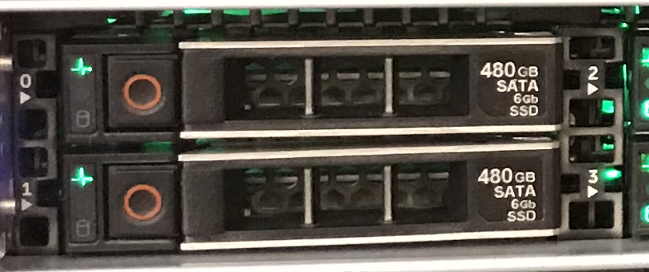
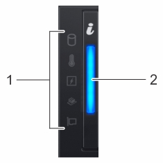

# Monitor Azure FXT Edge Filer hardware status

The Azure FXT Edge Filer hybrid storage cache system has multiple status lights built in to the chassis to help administrators understand how the hardware is functioning.

## System health status

To monitor cache operations at a higher level, use the software Control Panel's **Dashboard** page, as described in the [Control Panel Dashboard Guide](https://azure.github.io/Avere/legacy/dashboard/4_7/html/ops_dashboard_index.html)

## Hardware status LEDs

This section explains the various status lights built in to the Azure FXT Edge Filer hardware.

### Hard drive status LEDs

Each drive carrier has two status LEDs: an activity indicator (1) and a status indicator (2).

* The activity LED (1) lights when the drive is in use.
* The status LED (2) indicates the condition of the drive by using the codes in the table below.

| Drive status LED state              | Meaning  |
|-------------------------------------|----------------------------------------------------------|
| Flashes green twice per second      | Identifying drive *or*   Preparing drive for removal  |
| Off (unlit)                         | System has not finished startup *or*  Drive is ready to be removed |
| Flashes green, amber, and off       | Drive failure is predicted   |
| Flashes amber four times per second | Drive failed   |
| Solid green                         | Drive is online |

The right side of the drive (3) is labeled with the drive's capacity and other information.

Drive numbers are printed on the space between drives. In the Azure FXT Edge Filer, drive 0 is the top left drive, and drive 1 is directly underneath it. Numbering continues in that pattern.

## Left control panel

The left front control panel has various status LED indicators (1) and a large lighted system health indicator (2).

### Control panel status indicators

The status indicators at left show a solid amber light if there is an error in that system. The table below describes possible causes and solutions for the errors.

If you still have the error after trying these solutions, [contact support](support-ticket.md) for help.

| Icon | Description | Error condition | Possible solutions |
|----------------|---------------|--------------------|----------------------|
|  | Drive status | Drive error | Check the System Event Log to determine if the drive has an error, or  Run the appropriate online diagnostics test; restart the system and run embedded diagnostics (ePSA), or  If the drives are configured in a RAID array, restart the system and enter the host adapter configuration utility program |
| | Temperature status | Thermal error - for example, a fan has failed or ambient temperature is out of range | Check for the following addressable conditions:  A cooling fan is missing or has failed  The system's cover, air shroud, memory module blank, or back filler bracket is removed  The ambient temperature is too high  External airflow is obstructed |
| | Electrical status | Electrical error - for example, voltage out of range, failed PSU, or a failed voltage regulator |  Check the system event log or system messages for the specific issue. If there is a PSU problem, check the PSU status LED and reseat the PSU if needed. |
| | Memory status | Memory error | Check the system event log or system messages for the location of the failed memory; reseat the memory module. |
| | PCIe status | PCIe card error | Restart the system; update PCIe card drivers; reinstall the card |

### System health status indicator

The large lit button at the right of the left control panel indicates overall system status and also is used as a unit locator light in system ID mode.

Press the system health and ID button to switch between system ID mode and system health mode.

|System health status state | Condition |
|-------------------------------------------|-----------------------------------------------|
| Solid blue | Normal operation: the system is turned on, operating normally, and system ID mode is not active.  Press the system health and ID button if you want to switch to system ID mode. |
| Blinking blue | System ID mode is active. Press the system health and system ID button if you want to switch to system health mode. |
| Solid amber | The system is in fail-safe mode. If the problem persists, [contact Microsoft Customer Service and Support](support-ticket.md). |
| Blinking amber | System fault. Check the system event log for specific error messages. For information about the event and error messages generated by the system firmware and agents that monitor system components, see the Error Code Lookup page at qrl.dell.com. |
