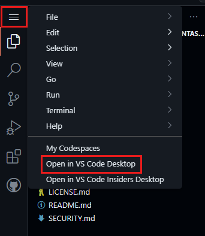

Use GitHub Codespaces to try Azure IoT Operations on a Kubernetes cluster without installing anything on your local machine. The **Azure-Samples/explore-iot-operations** codespace is preconfigured with:

- [K3s](https://k3s.io/) running in [K3d](https://k3d.io/) for a lightweight Kubernetes cluster
- [Azure CLI](/cli/azure/install-azure-cli)
- [Kubectl](https://kubernetes.io/docs/tasks/tools/) for managing Kubernetes resources
- Other useful tools like [Helm](https://helm.sh/) and [k9s](https://k9scli.io/)

To create your codespace and cluster, use the following steps:

1. Create a codespace in GitHub Codespaces.

   

1. Provide the following recommended secrets for your codespace:

   | Parameter | Value |
   | --------- | ----- |
   | SUBSCRIPTION_ID | Your Azure subscription ID. |
   | RESOURCE_GROUP | A name for a new Azure resource group where your cluster will be created. |
   | LOCATION | An Azure region close to you. For the list of currently supported regions, see [Supported regions](../overview-iot-operations.md#supported-regions). |

   >[!TIP]
   >The values you provide as secrets in this step get saved on your GitHub account to be used in this and future codespaces. They're added as environment variables in the codespace terminal, and you can use those environment variables in the CLI commands in the next section.
   >
   >Additionally, this codespace creates a `CLUSTER_NAME` environment variable which is set with the codespace name.

1. Select **Create new codespace**.

1. Once the codespace is ready, select the menu button at the top left, then select **Open in VS Code Desktop**.

   

1. If prompted, install the **GitHub Codespaces** extension for Visual Studio Code and sign in to GitHub.

1. In Visual Studio Code, select **View** > **Terminal**.

   Use this terminal to run all of the CLI commands for managing your cluster.
