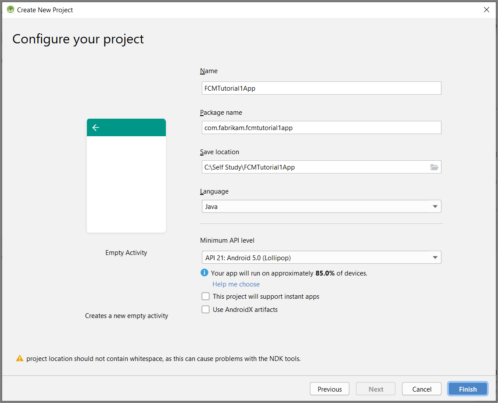
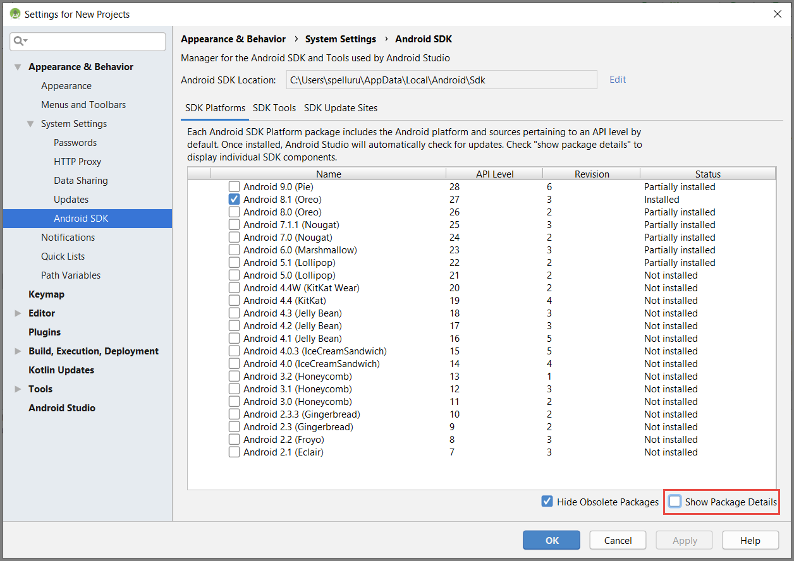
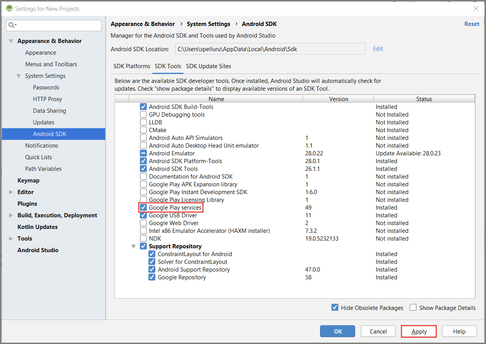
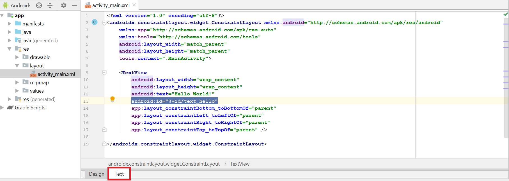
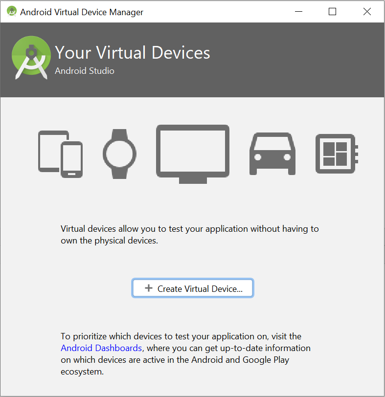
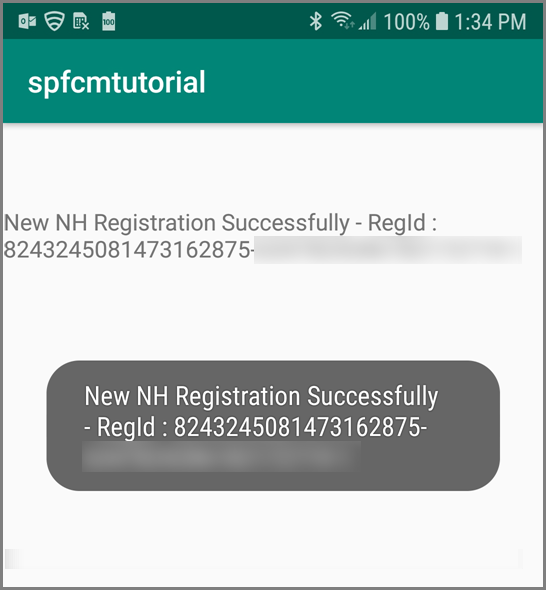
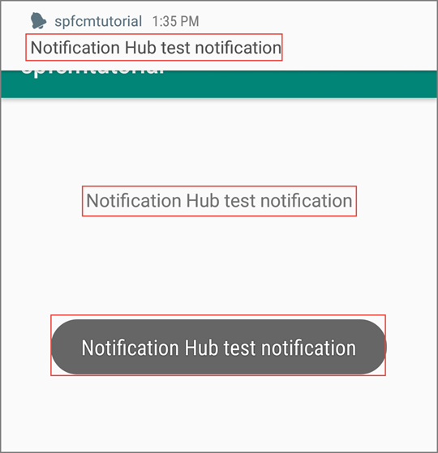

# Tutorial: Send push notifications to Android devices using Firebase SDK version 0.6

[!INCLUDE [notification-hubs-selector-get-started](../../includes/notification-hubs-selector-get-started.md)]

This tutorial shows you how to use Azure Notification Hubs and the Firebase Cloud Messaging (FCM) SDK version 0.6 to send push notifications to an Android application. In this tutorial, you create a blank Android app that receives push notifications by using Firebase Cloud Messaging (FCM).

> [!IMPORTANT]
> Google will stop supporting FCM legacy HTTP on June 20, 2024. For more information, see [Azure Notification Hubs and Google Firebase Cloud Messaging migration](notification-hubs-gcm-to-fcm.md).

The completed code for this tutorial can be downloaded [from GitHub](https://github.com/Azure/azure-notificationhubs-android/tree/master/FCMTutorialApp).

In this tutorial, you take the following steps:

> [!div class="checklist"]
> * Create an Android Studio project.
> * Create a Firebase project that supports Firebase Cloud Messaging.
> * Create a hub.
> * Connect your app to the hub.
> * Test the app.

## Prerequisites

To complete this tutorial, you must have an active Azure account. If you don't have an account, you can create a free trial account in just a couple of minutes. For details, see [Azure Free Trial](https://azure.microsoft.com/free/). 

You also need the following items: 

* The latest version of [Android Studio](https://go.microsoft.com/fwlink/?LinkId=389797)
* Android 2.3 or higher for Firebase Cloud Messaging
* Google Repository revision 27 or higher for Firebase Cloud Messaging
* Google Play Services 9.0.2 or higher for Firebase Cloud Messaging

Completing this tutorial is a prerequisite for doing all other Notification Hubs tutorials for Android apps.

## Create an Android Studio Project

1. Launch Android Studio.
2. Select **File**, point to **New**, and then select **New Project**. 
2. On the **Choose your project** page, select **Empty Activity**, and then select **Next**. 
3. On the **Configure your project** page, take the following steps: 
    1. Enter a name for the application.
    2. Specify a location in which to save the project files. 
    3. Select **Finish**. 

        

## Create a Firebase project that supports FCM

[!INCLUDE [notification-hubs-enable-firebase-cloud-messaging](../../includes/notification-hubs-enable-firebase-cloud-messaging.md)]

## Configure a hub

[!INCLUDE [notification-hubs-portal-create-new-hub](../../includes/notification-hubs-portal-create-new-hub.md)]

### Configure Firebase Cloud Messaging settings for the hub

1. In the left pane, under **Settings,** select **Google (GCM/FCM)**. 
2. Enter the **server key** for the FCM project that you saved earlier. 
3. On the toolbar, select **Save**. 

    
4. The Azure portal displays a message in alerts that the hub has been successfully updated. The **Save** button is disabled. 

Your hub is now configured to work with Firebase Cloud Messaging. You also have the connection strings that are necessary to send notifications to a device and register an app to receive notifications.

## <a id="connecting-app"></a>Connect your app to the notification hub

### Add Google Play services to the project

1. In Android Studio, select **Tools** on the menu, and then select **SDK Manager**. 
2. Select the target version of the Android SDK that is used in your project. Then select **Show Package Details**. 

    
3. Select **Google APIs**, if it's not already installed.

    
4. Switch to the **SDK Tools** tab. If you haven't already installed Google Play Services, select **Google Play Services** as shown in the following image. Then select **Apply** to install. Note the SDK path, for use in a later step.

    
3. If you see the **Confirm Change** dialog box, select **OK**. The Component Installer installs the requested components. Select **Finish** after the components are installed.
4. Select **OK** to close the **Settings for New Projects** dialog box.  
1. Open the AndroidManifest.xml file, and then add the following tag to the *application* tag.

    ```xml
    <meta-data android:name="com.google.android.gms.version"
         android:value="@integer/google_play_services_version" />
    ```


### Add Azure Notification Hubs libraries

1. In the Build.Gradle file for the app, add the following lines in the dependencies section.

    ```gradle
    implementation 'com.microsoft.azure:notification-hubs-android-sdk:0.6@aar'
    ```

2. Add the following repository after the dependencies section.

    ```gradle
    repositories {
        maven {
            url "https://dl.bintray.com/microsoftazuremobile/SDK"
        }
    }
    ```

### Add Google Firebase support

1. In the Build.Gradle file for the app, add the following lines in the **dependencies** section if they don't already exist. 

    ```gradle
    implementation 'com.google.firebase:firebase-core:16.0.8'
    implementation 'com.google.firebase:firebase-messaging:17.3.4'
    implementation 'com.google.firebase:firebase-iid:21.1.0'
    ```

2. Add the following plug-in at the end of the file if it's not already there. 

    ```gradle
    apply plugin: 'com.google.gms.google-services'
    ```
3. Select **Sync Now** on the toolbar.

### Update the AndroidManifest.xml file

1. After you receive your FCM registration token, you use it to [register with Azure Notification Hubs](notification-hubs-push-notification-registration-management.md). You support this registration in the background by using an `IntentService` named `RegistrationIntentService`. This service also refreshes your FCM registration token. You also create a class named `FirebaseService` as a subclass of `FirebaseMessagingService` and override the `onMessageReceived` method to receive and handle notifications. 

    Add the following service definition to the AndroidManifest.xml file, inside the `<application>` tag.

    ```xml
    <service
        android:name=".RegistrationIntentService"
        android:exported="false">
    </service>
    <service
        android:name=".FirebaseService"
        android:exported="false">
        <intent-filter>
            <action android:name="com.google.firebase.MESSAGING_EVENT" />
        </intent-filter>
    </service>
    ```
3. Add the following necessary FCM-related permissions below the `</application>` tag.

    ```xml
    <uses-permission android:name="android.permission.INTERNET"/>
    <uses-permission android:name="android.permission.GET_ACCOUNTS"/>
    <uses-permission android:name="com.google.android.c2dm.permission.RECEIVE" />
    ```

### Add code

1. In the Project View, expand **app** > **src** > **main** > **java**. Right-click your package folder under **java**, select **New**, and then select **Java Class**. Enter **NotificationSettings** for the name, and then select **OK**.

    Make sure to update these two placeholders in the following code for the `NotificationSettings` class:

   * **HubListenConnectionString**: The **DefaultListenAccessSignature** connection string for your hub. You can copy that connection string by clicking **Access Policies** in your hub in the [Azure portal].
   * **HubName**: Use the name of your hub that appears in the hub page in the [Azure portal].

     `NotificationSettings` code:

        ```java
        public class NotificationSettings {
            public static String HubName = "<Your HubName>";
            public static String HubListenConnectionString = "<Enter your DefaultListenSharedAccessSignature connection string>";
        }
        ```

     > [!IMPORTANT]
     > Enter the **name** and the **DefaultListenSharedAccessSignature** of your hub before proceeding further. 

2. Add another new class to your project named `RegistrationIntentService`. This class implements the `IntentService` interface. It also handles [refreshing the FCM token](https://developers.google.com/instance-id/guides/android-implementation#refresh_tokens) and [registering with the notification hub](notification-hubs-push-notification-registration-management.md).

    Use the following code for this class.

    ```java
    import android.app.IntentService;
    import android.content.Intent;
    import android.content.SharedPreferences;
    import android.preference.PreferenceManager;
    import android.util.Log;
    import com.google.android.gms.tasks.OnSuccessListener;
    import com.google.firebase.iid.FirebaseInstanceId;
    import com.google.firebase.iid.InstanceIdResult;
    import com.microsoft.windowsazure.messaging.NotificationHub;
    import java.util.concurrent.TimeUnit;

    public class RegistrationIntentService extends IntentService {

        private static final String TAG = "RegIntentService";
        String FCM_token = null;

        private NotificationHub hub;

        public RegistrationIntentService() {
            super(TAG);
        }

        @Override
        protected void onHandleIntent(Intent intent) {

            SharedPreferences sharedPreferences = PreferenceManager.getDefaultSharedPreferences(this);
            String resultString = null;
            String regID = null;
            String storedToken = null;

            try {
                FirebaseInstanceId.getInstance().getInstanceId().addOnSuccessListener(new OnSuccessListener<InstanceIdResult>() { 
                    @Override 
                    public void onSuccess(InstanceIdResult instanceIdResult) { 
                        FCM_token = instanceIdResult.getToken(); 
                        Log.d(TAG, "FCM Registration Token: " + FCM_token); 
                    } 
                }); 
                TimeUnit.SECONDS.sleep(1);

                // Storing the registration ID that indicates whether the generated token has been
                // sent to your server. If it is not stored, send the token to your server.
                // Otherwise, your server should have already received the token.
                if (((regID=sharedPreferences.getString("registrationID", null)) == null)){

                    NotificationHub hub = new NotificationHub(NotificationSettings.HubName,
                            NotificationSettings.HubListenConnectionString, this);
                    Log.d(TAG, "Attempting a new registration with NH using FCM token : " + FCM_token);
                    regID = hub.register(FCM_token).getRegistrationId();

                    // If you want to use tags...
                    // Refer to : https://azure.microsoft.com/documentation/articles/notification-hubs-routing-tag-expressions/
                    // regID = hub.register(token, "tag1,tag2").getRegistrationId();

                    resultString = "New NH Registration Successfully - RegId : " + regID;
                    Log.d(TAG, resultString);

                    sharedPreferences.edit().putString("registrationID", regID ).apply();
                    sharedPreferences.edit().putString("FCMtoken", FCM_token ).apply();
                }

                // Check to see if the token has been compromised and needs refreshing.
               else if (!(storedToken = sharedPreferences.getString("FCMtoken", "")).equals(FCM_token)) {

                    NotificationHub hub = new NotificationHub(NotificationSettings.HubName,
                            NotificationSettings.HubListenConnectionString, this);
                    Log.d(TAG, "NH Registration refreshing with token : " + FCM_token);
                    regID = hub.register(FCM_token).getRegistrationId();

                    // If you want to use tags...
                    // Refer to : https://azure.microsoft.com/documentation/articles/notification-hubs-routing-tag-expressions/
                    // regID = hub.register(token, "tag1,tag2").getRegistrationId();

                    resultString = "New NH Registration Successfully - RegId : " + regID;
                    Log.d(TAG, resultString);

                    sharedPreferences.edit().putString("registrationID", regID ).apply();
                    sharedPreferences.edit().putString("FCMtoken", FCM_token ).apply();
                }

                else {
                    resultString = "Previously Registered Successfully - RegId : " + regID;
                }
            } catch (Exception e) {
                Log.e(TAG, resultString="Failed to complete registration", e);
                // If an exception happens while fetching the new token or updating registration data
                // on a third-party server, this ensures that we'll attempt the update at a later time.
            }

            // Notify UI that registration has completed.
            if (MainActivity.isVisible) {
                MainActivity.mainActivity.ToastNotify(resultString);
            }
        }
    }
    ```

3. In the `MainActivity` class, add the following `import` statements above the class declaration.

    ```java
    import com.google.android.gms.common.ConnectionResult;
    import com.google.android.gms.common.GoogleApiAvailability;
    import android.content.Intent;
    import android.util.Log;
    import android.widget.TextView;
    import android.widget.Toast;
    ```

4. Add the following members at the top of the class. You use these fields to [check the availability of Google Play Services as recommended by Google](https://developers.google.com/android/guides/setup#ensure_devices_have_the_google_play_services_apk).

    ```java
    public static MainActivity mainActivity;
    public static Boolean isVisible = false;
    private static final String TAG = "MainActivity";
    private static final int PLAY_SERVICES_RESOLUTION_REQUEST = 9000;
    ```

5. In the `MainActivity` class, add the following method to check the availability of Google Play Services.

    ```java
    /**
    * Check the device to make sure it has the Google Play Services APK. If
    * it doesn't, display a dialog box that enables  users to download the APK from
    * the Google Play Store or enable it in the device's system settings.
    */

    private boolean checkPlayServices() {
        GoogleApiAvailability apiAvailability = GoogleApiAvailability.getInstance();
        int resultCode = apiAvailability.isGooglePlayServicesAvailable(this);
        if (resultCode != ConnectionResult.SUCCESS) {
            if (apiAvailability.isUserResolvableError(resultCode)) {
                apiAvailability.getErrorDialog(this, resultCode, PLAY_SERVICES_RESOLUTION_REQUEST)
                        .show();
            } else {
                Log.i(TAG, "This device is not supported by Google Play Services.");
                ToastNotify("This device is not supported by Google Play Services.");
                finish();
            }
            return false;
        }
        return true;
    }
    ```

6. In the `MainActivity` class, add the following code that checks for Google Play Services before calling the `IntentService` to get your FCM registration token and register with your hub:

    ```java
    public void registerWithNotificationHubs()
    {
        if (checkPlayServices()) {
            // Start IntentService to register this application with FCM.
            Intent intent = new Intent(this, RegistrationIntentService.class);
            startService(intent);
        }
    }
    ```

7. In the `OnCreate` method of the `MainActivity` class, add the following code to start the registration process when the activity is created:

    ```java
    @Override
    protected void onCreate(Bundle savedInstanceState) {
        super.onCreate(savedInstanceState);
        setContentView(R.layout.activity_main);

        mainActivity = this;
        registerWithNotificationHubs();
        FirebaseService.createChannelAndHandleNotifications(getApplicationContext());
    }
    ```

8. To verify app state and report status in your app, add these additional methods to `MainActivity`:

    ```java
    @Override
    protected void onStart() {
        super.onStart();
        isVisible = true;
    }

    @Override
    protected void onPause() {
        super.onPause();
        isVisible = false;
    }

    @Override
    protected void onResume() {
        super.onResume();
        isVisible = true;
    }

    @Override
    protected void onStop() {
        super.onStop();
        isVisible = false;
    }

    public void ToastNotify(final String notificationMessage) {
        runOnUiThread(new Runnable() {
            @Override
            public void run() {
                Toast.makeText(MainActivity.this, notificationMessage, Toast.LENGTH_LONG).show();
                TextView helloText = (TextView) findViewById(R.id.text_hello);
                helloText.setText(notificationMessage);
            }
        });
    }
    ```

9. The `ToastNotify` method uses the *"Hello World"* `TextView` control to report status and notifications persistently in the app. In your **res** > **layout** > **activity_main.xml** layout, add the following ID for that control.

    ```java
    android:id="@+id/text_hello"
    ```

    

10. Next you add a subclass for the receiver that you defined in AndroidManifest.xml. Add another new class to your project named `FirebaseService`.

11. Add the following import statements at the top of `FirebaseService.java`:

    ```java
    import com.google.firebase.messaging.FirebaseMessagingService;
    import com.google.firebase.messaging.RemoteMessage;
    import android.util.Log;
    import android.app.NotificationChannel;
    import android.app.NotificationManager;
    import android.app.PendingIntent;
    import android.content.Context;
    import android.content.Intent;
    import android.media.RingtoneManager;
    import android.net.Uri;
    import android.os.Build;
    import android.os.Bundle;
    import androidx.core.app.NotificationCompat;
    ```

12. Add the following code for the `FirebaseService` class, making it a subclass of `FirebaseMessagingService`.

    This code overrides the `onMessageReceived` method and reports notifications that are received. it also sends the push notification to the Android notification manager by using the `sendNotification()` method. Call the `sendNotification()` method when the app isn't running and a notification is received.

    ```java
    public class FirebaseService extends FirebaseMessagingService
    {
        private String TAG = "FirebaseService";
    
        public static final String NOTIFICATION_CHANNEL_ID = "nh-demo-channel-id";
        public static final String NOTIFICATION_CHANNEL_NAME = "Notification Hubs Demo Channel";
        public static final String NOTIFICATION_CHANNEL_DESCRIPTION = "Notification Hubs Demo Channel";
    
        public static final int NOTIFICATION_ID = 1;
        private NotificationManager mNotificationManager;
        NotificationCompat.Builder builder;
        static Context ctx;
    
        @Override
        public void onMessageReceived(RemoteMessage remoteMessage) {
            // ...
    
            // TODO(developer): Handle FCM messages here.
            // Not getting messages here? See why this may be: https://goo.gl/39bRNJ
            Log.d(TAG, "From: " + remoteMessage.getFrom());
    
            String nhMessage;
            // Check if message contains a notification payload.
            if (remoteMessage.getNotification() != null) {
                Log.d(TAG, "Message Notification Body: " + remoteMessage.getNotification().getBody());
    
                nhMessage = remoteMessage.getNotification().getBody();
            }
            else {
                nhMessage = remoteMessage.getData().values().iterator().next();
            }
    
            // Also if you intend on generating your own notifications as a result of a received FCM
            // message, here is where that should be initiated. See sendNotification method below.
            if (MainActivity.isVisible) {
                MainActivity.mainActivity.ToastNotify(nhMessage);
            }
            sendNotification(nhMessage);
        }
    
        private void sendNotification(String msg) {
    
            Intent intent = new Intent(ctx, MainActivity.class);
            intent.addFlags(Intent.FLAG_ACTIVITY_CLEAR_TOP);
    
            mNotificationManager = (NotificationManager)
                    ctx.getSystemService(Context.NOTIFICATION_SERVICE);
    
            PendingIntent contentIntent = PendingIntent.getActivity(ctx, 0,
                    intent, PendingIntent.FLAG_ONE_SHOT);
    
            Uri defaultSoundUri = RingtoneManager.getDefaultUri(RingtoneManager.TYPE_NOTIFICATION);
            NotificationCompat.Builder notificationBuilder = new NotificationCompat.Builder(
                    ctx,
                    NOTIFICATION_CHANNEL_ID)
                    .setContentText(msg)
                    .setPriority(NotificationCompat.PRIORITY_HIGH)
                    .setSmallIcon(android.R.drawable.ic_popup_reminder)
                    .setBadgeIconType(NotificationCompat.BADGE_ICON_SMALL);
    
            notificationBuilder.setContentIntent(contentIntent);
            mNotificationManager.notify(NOTIFICATION_ID, notificationBuilder.build());
        }
    
        public static void createChannelAndHandleNotifications(Context context) {
            ctx = context;
    
            if (Build.VERSION.SDK_INT >= Build.VERSION_CODES.O) {
                NotificationChannel channel = new NotificationChannel(
                        NOTIFICATION_CHANNEL_ID,
                        NOTIFICATION_CHANNEL_NAME,
                        NotificationManager.IMPORTANCE_HIGH);
                channel.setDescription(NOTIFICATION_CHANNEL_DESCRIPTION);
                channel.setShowBadge(true);
    
                NotificationManager notificationManager = context.getSystemService(NotificationManager.class);
                notificationManager.createNotificationChannel(channel);
             }
        }
    }
    ```

13. In Android Studio, on the menu bar, select **Build** > **Rebuild Project** to make sure that there aren't any errors in your code. If you receive an error about the `ic_launcher` icon, remove the following statement from the AndroidManifest.xml file: 

    ```
        android:icon="@mipmap/ic_launcher"
    ```
14. Ensure you have a virtual device for running the app. If you do not have one, add one as follows:
    1. 
    2. 

15. Run the app on your selected device and verify that it registers successfully with the hub.

    > [!NOTE]
    > Registration might fail during the initial launch until the `onTokenRefresh()` method of the instance ID service is called. The refresh should initiate a successful registration with the notification hub.

    

## Test send notification from the notification hub

You can send push notifications from the [Azure portal] by taking the following steps:

1. In the Azure portal, on the Notification Hub page for your hub, select **Test Send** in the **Troubleshooting** section.
3. For **Platforms**, select **Android**.
4. Select **Send**.  You won't see a notification on the Android device yet because you haven't run the mobile app on it. After you run the mobile app, select the **Send** button again to see the notification message.
5. See the result of the operation in the list at the bottom.

    
6. You see the notification message on your device. 

    
    

[!INCLUDE [notification-hubs-sending-notifications-from-the-portal](../../includes/notification-hubs-sending-notifications-from-the-portal.md)]

### Run the mobile app on emulator

Before you test push notifications inside an emulator, make sure that your emulator image supports the Google API level that you chose for your app. If your image doesn't support native Google APIs, you might get the **SERVICE\_NOT\_AVAILABLE** exception.

Also make sure that you've added your Google account to your running emulator under **Settings** > **Accounts**. Otherwise, your attempts to register with FCM might result in the **AUTHENTICATION\_FAILED** exception.

## Next steps

In this tutorial, you used Firebase Cloud Messaging to broadcast notifications to all Android devices that were registered with the service. To learn how to push notifications to specific devices, advance to the following tutorial:

> [!div class="nextstepaction"]
>[Tutorial: Push notifications to specific Android devices](push-notifications-android-specific-devices-firebase-cloud-messaging.md)

<!-- Images. -->

<!-- URLs. -->
[Get started with push notifications in Mobile Services]: ../mobile-services-javascript-backend-android-get-started-push.md  
[Mobile Services Android SDK]: https://go.microsoft.com/fwLink/?LinkID=280126&clcid=0x409
[Referencing a library project]: https://go.microsoft.com/fwlink/?LinkId=389800
[Notification Hubs Guidance]: notification-hubs-push-notification-overview.md
[Azure portal]: https://portal.azure.com
