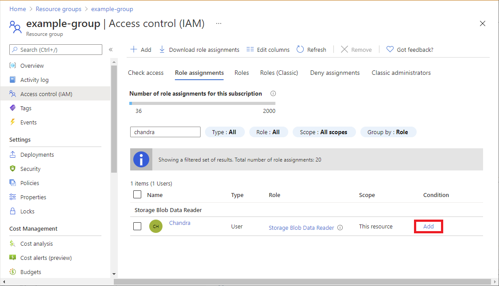
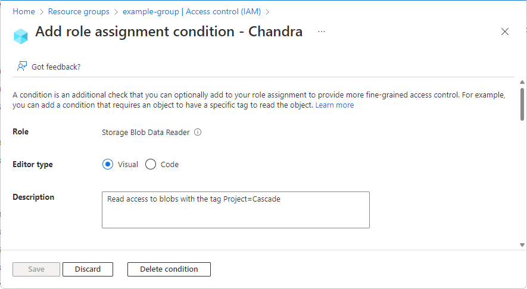
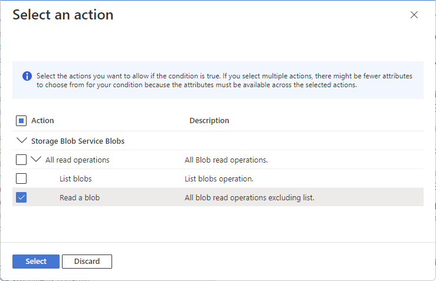
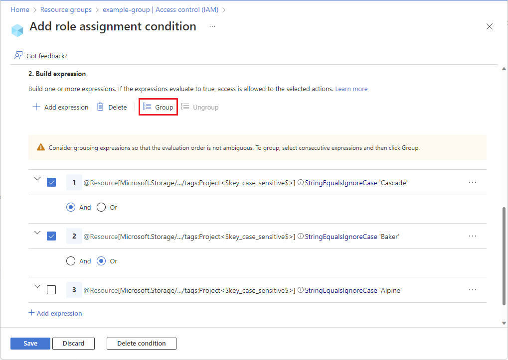
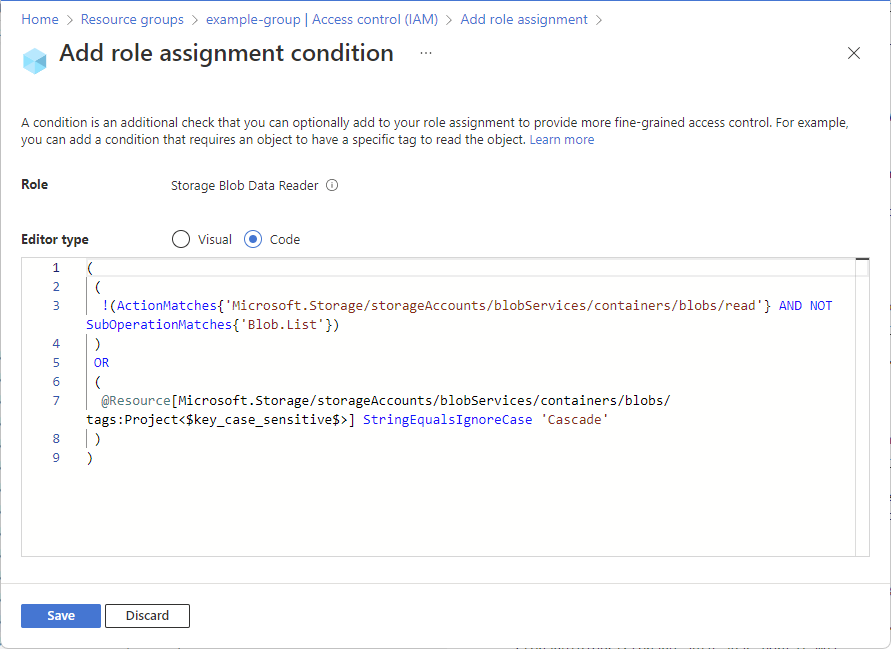
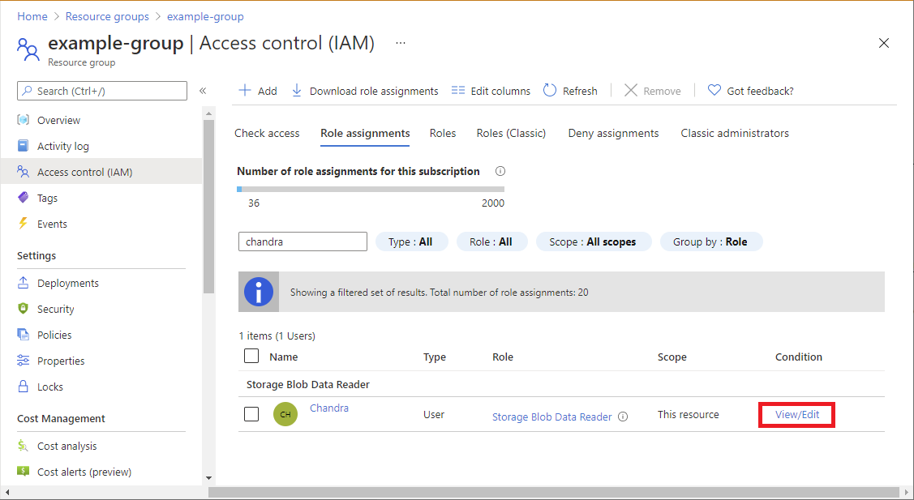
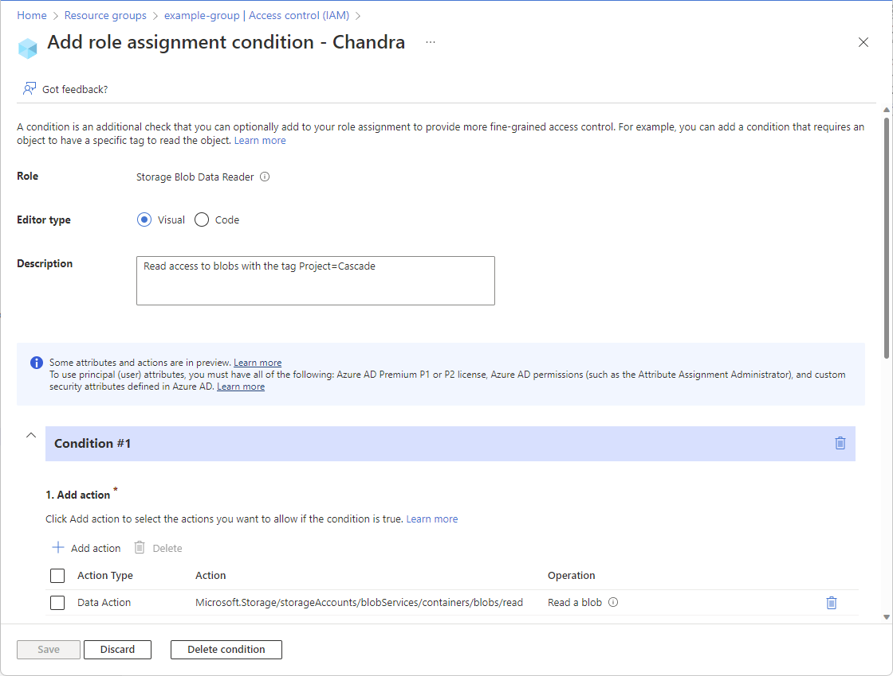

# Add or edit Azure role assignment conditions using the Azure portal

An [Azure role assignment condition](conditions-overview.md) is an optional check that you can add to your role assignment to provide more fine-grained access control. For example, you can add a condition that requires an object to have a specific tag to read the object. This article describes how to add, edit, view, or delete conditions for your role assignments using the Azure portal.

## Prerequisites

For information about the prerequisites to add or edit role assignment conditions, see [Conditions prerequisites](conditions-prerequisites.md).

## Step 1: Determine the condition you need

To get some ideas about conditions that could be useful to you, review the examples in [Example Azure role assignment conditions for Blob Storage](../storage/blobs/storage-auth-abac-examples.md).

Currently, conditions can be added to built-in or custom role assignments that have [blob storage data actions](../storage/blobs/storage-auth-abac-attributes.md) or [queue storage data actions](../storage/queues/queues-auth-abac-attributes.md). These include the following built-in roles:

- [Storage Blob Data Contributor](built-in-roles.md#storage-blob-data-contributor)
- [Storage Blob Data Owner](built-in-roles.md#storage-blob-data-owner)
- [Storage Blob Data Reader](built-in-roles.md#storage-blob-data-reader)
- [Storage Queue Data Contributor](built-in-roles.md#storage-queue-data-contributor)
- [Storage Queue Data Message Processor](built-in-roles.md#storage-queue-data-message-processor)
- [Storage Queue Data Message Sender](built-in-roles.md#storage-queue-data-message-sender)
- [Storage Queue Data Reader](built-in-roles.md#storage-queue-data-reader)

## Step 2: Choose how to add condition

There are two ways that you can add a condition. You can add a condition when you add a new role assignment or you can add a condition to an existing role assignment.

### New role assignment

1. Follow the steps to [Assign Azure roles using the Azure portal](role-assignments-portal.yml).

1. On the **Conditions (optional)** tab, click **Add condition**.

    If you don't see the Conditions (optional) tab, be sure you selected a role that supports conditions.

   

    The Add role assignment condition page appears.

### Existing role assignment

1. In the Azure portal, open **Access control (IAM)** at the scope where you want to add a condition. For example, you can open a subscription, resource group, or a resource.

    Currently, you can't use the Azure portal to add, view, edit, or delete a condition add at a management group scope.

1. Click the **Role assignments** tab to view all the role assignments at this scope.

1. Find a role assignment that has storage data actions that you want to add a condition to.

1. In the **Condition** column, click **Add**.

    If you don't see the Add link, be sure you're looking at the same scope as the role assignment.

    

    The Add role assignment condition page appears.

## Step 3: Review basics

Once you have the Add role assignment condition page open, you can review the basics of the condition. **Role** indicates the role that the condition will be added to.

1. For the **Editor type** option, leave the default **Visual** selected.

    Once you add a condition, you can toggle between Visual and Code.

1. (Optional) If the **Description** box appears, enter a description.

    Depending on how you chose to add a condition, you might not see the Description box. A description can help you understand and remember the purpose of the condition.

    

## Step 4: Add actions

1. In the **Add action** section, click **Add action**.

    The Select an action pane appears. This pane is a filtered list of data actions based on the role assignment that will be the target of your condition. For more information, see [Azure role assignment condition format and syntax](conditions-format.md#actions).

    

1. Select the actions you want to allow if the condition is true.

    If you select multiple actions for a single condition, there might be fewer attributes to choose from for your condition because the attributes must be available across the selected actions.

1. Click **Select**.

    The selected actions appear in the action list.

## Step 5: Build expressions

1. In the **Build expression** section, click **Add expression**.

    The Expressions section expands.

1. In the **Attribute source** list, select where the attribute can be found.

    - **Environment** indicates that the attribute is associated with the network environment over which the resource is accessed such as a private link, or the current date and time.
    - **Resource** indicates that the attribute is on the resource, such as container name.
    - **Request** indicates that the attribute is part of the action request, such as setting the blob index tag.
    - **Principal** indicates that the attribute is a Microsoft Entra custom security attribute principal, such as a user, enterprise application (service principal), or managed identity.

1. In the **Attribute** list, select an attribute for the left side of the expression.

    For more information about supported attribute sources and individual attributes, see [Attributes](conditions-format.md#attributes).

    Depending on the attribute you select, boxes might be added to specify additional attribute details or operators. For example, some attributes support [the *Exists* function operator](conditions-format.md#exists), which you can use to test whether the attribute is currently associated with the resource such as an encryption scope.

1. In the **Operator** list, select an operator.

    For more information, see [Azure role assignment condition format and syntax](conditions-format.md).

1. In the **Value** box, enter a value for the right side of the expression.

    

1. Add more expressions as needed.

    If you add three or more expressions, you might need to group them with parentheses so the connecting logical operators are evaluated correctly. Add check marks next to the expressions you want to group and then select **Group**. To remove grouping, select **Ungroup**.

    

## Step 6: Review and add condition

1. Scroll up to **Editor type** and click **Code**.

    The condition is displayed as code. You can make changes to the condition in this code editor. The code editor can be useful for pasting sample code, or for adding more operators or logic to build more complex conditions. To go back to the visual editor, click **Visual**.

    

1. Click **Save** to add the condition to the role assignment.

## View, edit, or delete a condition

1. In the Azure portal, open **Access control (IAM)** for the role assignment that has a condition that you want to view, edit, or delete.

1. Click the **Role assignments** tab and find the role assignment.

1. In the **Condition** column, click **View/Edit**.

    If you don't see the View/Edit link, be sure you're looking at the same scope as the role assignment.

    

    The Add role assignment condition page appears.

1. Use the editor to view or edit the condition.

    

1. When finished, click **Save**. To delete the entire condition, click **Delete condition**. Deleting the condition does not remove the role assignment.

## Next steps

- [Example Azure role assignment conditions for Blob Storage](../storage/blobs/storage-auth-abac-examples.md)
- [Tutorial: Add a role assignment condition to restrict access to blobs using the Azure portal](../storage/blobs/storage-auth-abac-portal.md)
- [Troubleshoot Azure role assignment conditions](conditions-troubleshoot.md)
