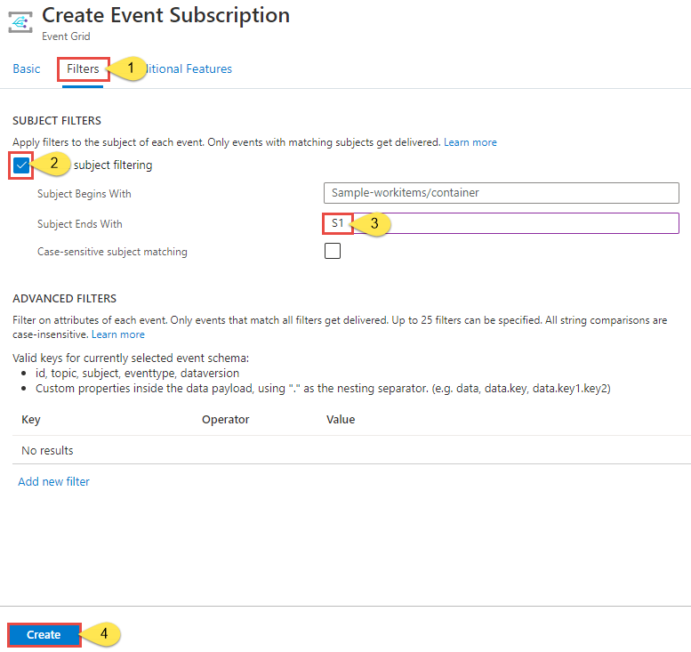
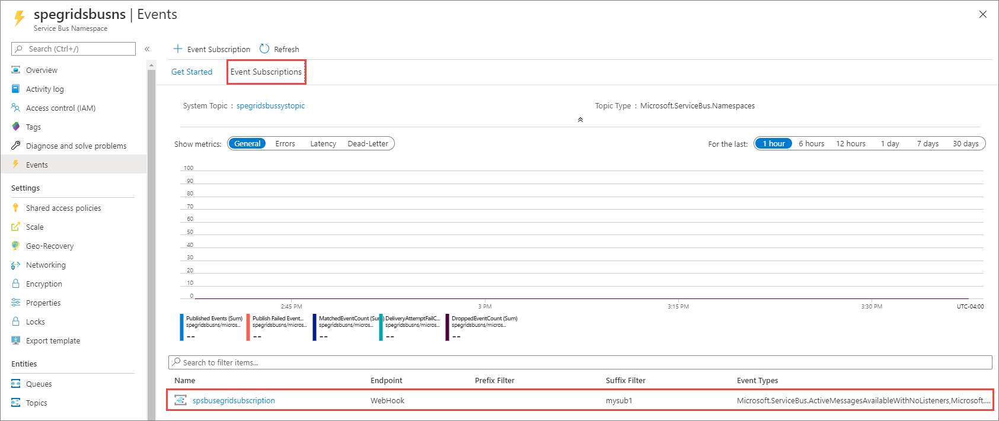

# Tutorial: Respond to Azure Service Bus events received via Azure Event Grid by using Azure Functions
In this tutorial, you learn how to respond to Azure Service Bus events that are received via Azure Event Grid by using Azure Functions and Azure Logic Apps. 

In this tutorial, you learn how to:
> [!div class="checklist"]
> * Create a Service Bus namespace
> * Prepare a sample application to send messages
> * Send messages to the Service Bus topic
> * Receive messages by using Logic Apps
> * Set up a test function on Azure
> * Connect the function and namespace via Event Grid
> * Receive messages by using Azure Functions

[!INCLUDE [service-bus-event-grid-prerequisites](./includes/service-bus-event-grid-prerequisites.md)]

## Additional prerequisites
Install [Visual Studio 2022](https://www.visualstudio.com/vs) and include the **Azure development** workload. This workload includes **Azure Function Tools** that you need to create, build, and deploy Azure Functions projects in Visual Studio. 

## Deploy the function app 

>[!NOTE]
> To learn more about creating and deploying an Azure Functions app, see [Develop Azure Functions using Visual Studio](../azure-functions/functions-develop-vs.md)

1. Open **ReceiveMessagesOnEvent.cs** file from the **FunctionApp1** project of the **SBEventGridIntegration.sln** solution. 
1. Replace `<SERVICE BUS NAMESPACE - CONNECTION STRING>` with the connection string to your Service Bus namespace. It should be the same as the one you used in the **Program.cs** file of the **MessageSender** project in the same solution. 
1. Right-click **FunctionApp1**, and select **Publish**. 
1. On the **Publish** page, select **Start**. These steps might be different from what you see, but the process of publishing should be similar. 
1. In the **Publish** wizard, on the **Target** page, select **Azure** for **Target**. 
1. On the **Specific target** page, select **Azure Function App (Windows)**. 
1. On the **Functions instance** page, select **Create a new Azure function**. 

    :::image type="content" source="./media/service-bus-to-event-grid-integration-example/add-function-button.png" alt-text="Image showing the Add function button of the Visual Studio - Publish dialog box.":::
1. On the **Function App (Windows)** page, follow these steps:
    1. Enter a **name** for the function app.
    1. Select an Azure **subscription**.
    1. Select an existing **resource group** or create a new resource group. For this tutorial, select the resource group that has the Service Bus namespace. 
    1. Select a **plan type** for App Service.
    1. Select a **location**. Select the same location as the Service Bus namespace. 
    1. Select an existing **Azure Storage** or select **New** to create a new Storage account to be used by the Functions app. 
    1. Select **Create** to create the Functions app. 
1. Back on the **Functions instance** page of the **Publish** wizard, select **Finish**. 
1. On the **Publish** page in Visual Studio, select **Publish** to publish the Functions app to Azure. 

    :::image type="content" source="./media/service-bus-to-event-grid-integration-example/publish-function-app.png" alt-text="Publish Functions app":::    
1. In the **Output** window, see the messages from build and publish, and confirm that they both succeeded. 
1. Now, on the **Publish** page, in the **Hosting** section, select **... (ellipsis)**, and select **Manage in Azure portal**. 
1. In the Azure portal, on the **Function App** page, select **Functions** in the left menu, and confirm that you see two functions: 

    :::image type="content" source="./media/service-bus-to-event-grid-integration-example/functions.png" alt-text="Screenshot showing the Functions page with the Event Grid Trigger function.":::
1. Select **EventGridTriggerFunction** from the list. We recommend that you use the Event Grid trigger with Azure Functions as it has a few benefits over using the HTTP trigger. For details, see [Azure function as an event handler for Event Grid events](../event-grid/handler-functions.md).
1. On the **Function** page for the **EventGridTriggerFunction**, select **Monitor** on the left menu. 
1. Select **Configure** to configure Application Insights to capture invocation log. You use this page to monitor function executions upon receiving Service Bus events from Event Grid. 
1. On the **Application Insights** page, enter a name for the resource, select a **location** for the resource, and then select **OK**. 
1. Select the function **EventGridTriggerFunction** at the top (breadcrumb menu) to navigate back to the **Function** page. 
1. Confirm that you on the **Monitor** page. 

    :::image type="content" source="./media/service-bus-to-event-grid-integration-example/monitor-before.png" alt-text="Monitor page for the function before function invocations":::
    
    Keep this page open in a tab your web browser. You'll refresh this page to see invocations for this function later.

## Connect the function and the Service Bus namespace via Event Grid
In this section, you tie together the function and the Service Bus namespace by using the Azure portal. 

To create an Azure Event Grid subscription, follow these steps:

1. In the Azure portal, go to your Service Bus namespace and then, in the left pane, select **Events**. Your namespace window opens, with two Event Grid subscriptions displayed in the right pane. 
    
    :::image type="content" source="./media/service-bus-to-event-grid-integration-example/service-bus-events-page.png" alt-text="Service Bus - events page":::
2. Select **+ Event Subscription** on the toolbar. 
3. On the **Create Event Subscription** page, do the following steps:
    1. Enter a **name** for the subscription. 
    2. Enter a **name** for the **system topic**. System topics are topics created for Azure resources such as Azure Storage account and Azure Service Bus. To learn more about system topics, see [System topics overview](../event-grid/system-topics.md).
    2. Select **Azure Function** for **Endpoint Type**, and choose **Select an endpoint**. 

        
    3. On the **Select Azure Function** page, select the subscription, resource group, function app, slot, and the function, and then select **Confirm selection**. 

        
    4. On the **Create Event Subscription** page, switch to the **Filters** tab, and do the following tasks:
        1. Select **Enable subject filtering**
        2. Enter the name of the subscription to the Service Bus topic (**S1**) you created earlier.
        3. Select the **Create** button. 

            
4. Switch to the **Event Subscriptions** tab of the **Events** page and confirm that you see the event subscription in the list.

    

## Monitor the Functions app
The messages you sent to the Service Bus topic earlier are forwarded to the subscription (S1). Event Grid forwards the messages at the subscription to the Azure function. In this step of the tutorial, you confirm the function was invoked and view the logged informational messages. 

1. On the page for your Azure function app, switch to the **Monitor** tab if it isn't already active. You should see an entry for each message posted to the Service Bus topic. If you don't see them, refresh the page after waiting for a few minutes. 

    :::image type="content" source="./media/service-bus-to-event-grid-integration-example/function-monitor.png" alt-text="Monitor page for the function after invocations":::
2. Select the invocation from the list to see the details. 

    :::image type="content" source="./media/service-bus-to-event-grid-integration-example/invocation-details.png" alt-text="Function invocation details" lightbox="./media/service-bus-to-event-grid-integration-example/invocation-details.png":::

    You can also use the **Logs** tab of the **Monitor** page to see the logging information as the messages are sent. There could some delay, so give it a few minutes to see the logged messages. 

    :::image type="content" source="./media/service-bus-to-event-grid-integration-example/function-logs.png" alt-text="Function logs" lightbox="./media/service-bus-to-event-grid-integration-example/function-logs.png":::

## Troubleshoot
If you don't see any function invocations after waiting and refreshing for sometime, follow these steps: 

1. Confirm that the messages reached the Service Bus topic. See the **incoming messages** counter on the **Service Bus Topic** page. In this case, I ran the **MessageSender** application twice, so I see 10 messages (5 messages for each run).

    :::image type="content" source="./media/service-bus-to-event-grid-integration-example/topic-incoming-messages.png" alt-text="Service Bus Topic page - incoming messages":::    
1. Confirm that there are **no active messages** at the Service Bus subscription. 
    If you don't see any events on this page, verify that the **Service Bus Subscription** page doesn't show any **Active message count**. If the number for this counter is greater than zero, the messages at the subscription aren't forwarded to the handler function (event subscription handler) for some reason. Verify that you've set up the event subscription properly. 

    :::image type="content" source="./media/service-bus-to-event-grid-integration-example/subscription-active-message-count.png" alt-text="Active message count at the Service Bus subscription":::    
1. You also see **delivered events** on the **Events** page of the Service Bus namespace. 

    :::image type="content" source="./media/service-bus-to-event-grid-integration-example/event-subscription-page.png" alt-text="Events page - delivered events" lightbox="./media/service-bus-to-event-grid-integration-example/invocation-details.png":::
1. You can also see that the events are delivered on the **Event Subscription** page. You can get to this page by selecting the event subscription on the **Events** page. 
    
    :::image type="content" source="./media/service-bus-to-event-grid-integration-example/event-subscription-delivered-events.png" alt-text="Event subscription page - delivered events":::
    

## Next steps

* Learn more about [Azure Event Grid](../event-grid/index.yml).
* Learn more about [Azure Functions](../azure-functions/index.yml).
* Learn more about the [Logic Apps feature of Azure App Service](../logic-apps/index.yml).
* Learn more about [Azure Service Bus](../service-bus-messaging/service-bus-messaging-overview.md).

[2]: ./media/service-bus-to-event-grid-integration-example/sbtoeventgrid2.png
[3]: ./media/service-bus-to-event-grid-integration-example/sbtoeventgrid3.png
[7]: ./media/service-bus-to-event-grid-integration-example/sbtoeventgrid7.png
[8]: ./media/service-bus-to-event-grid-integration-example/sbtoeventgrid8.png
[9]: ./media/service-bus-to-event-grid-integration-example/sbtoeventgrid9.png
[10]: ./media/service-bus-to-event-grid-integration-example/sbtoeventgrid10.png
[11]: ./media/service-bus-to-event-grid-integration-example/sbtoeventgrid11.png
[12]: ./media/service-bus-to-event-grid-integration-example/sbtoeventgrid12.png
[12-1]: ./media/service-bus-to-event-grid-integration-example/sbtoeventgrid12-1.png
[12-2]: ./media/service-bus-to-event-grid-integration-example/sbtoeventgrid12-2.png
[13]: ./media/service-bus-to-event-grid-integration-example/sbtoeventgrid13.png
[14]: ./media/service-bus-to-event-grid-integration-example/sbtoeventgrid14.png
[15]: ./media/service-bus-to-event-grid-integration-example/sbtoeventgrid15.png
[16]: ./media/service-bus-to-event-grid-integration-example/sbtoeventgrid16.png
[17]: ./media/service-bus-to-event-grid-integration-example/sbtoeventgrid17.png
[18]: ./media/service-bus-to-event-grid-integration-example/sbtoeventgrid18.png
[20]: ./media/service-bus-to-event-grid-integration-example/sbtoeventgridportal.png
[21]: ./media/service-bus-to-event-grid-integration-example/sbtoeventgridportal2.png
