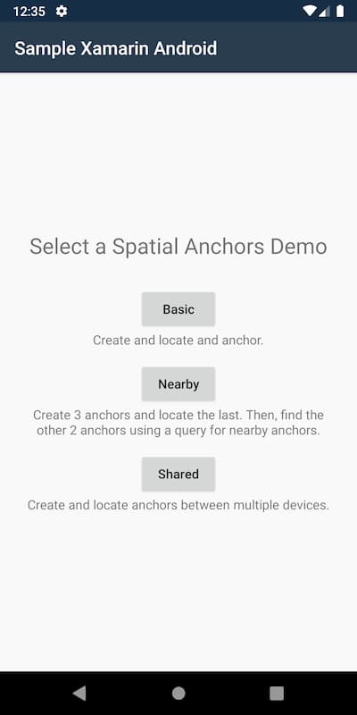
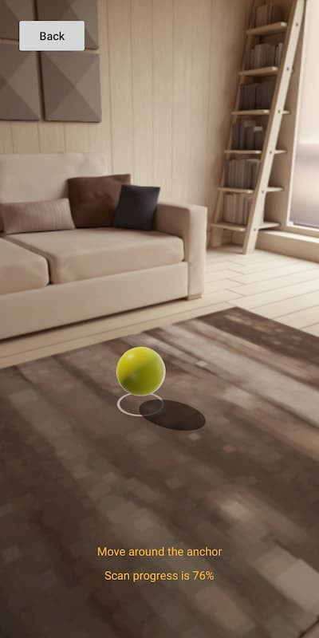
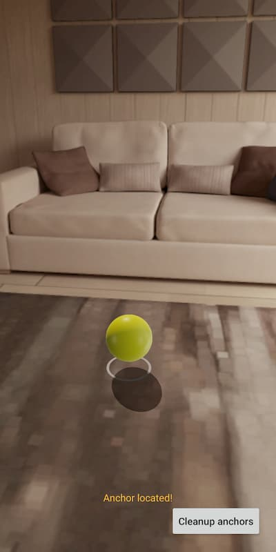

# Run the sample app: Android - Xamarin (C#)

This quickstart covers how to run the [Azure Spatial Anchors](../overview.md) sample app for Android devices using Xamarin (C#). Azure Spatial Anchors is a cross-platform developer service that allows you to create mixed reality experiences using objects that persist their location across devices over time. When you're finished, you'll have an Android app that can save and recall a spatial anchor.

You'll learn how to:

> [!div class="checklist"]
> * Create a Spatial Anchors account
> * Configure the Spatial Anchors account identifier and account key
> * Deploy and run on an Android device

[!INCLUDE [quickstarts-free-trial-note](~/reusable-content/ce-skilling/azure/includes/quickstarts-free-trial-note.md)]

## Prerequisites

To complete this quickstart, make sure you have:
- A Windows or macOS computer:
  - If using Windows:
    - An up-to-date version of <a href="https://www.visualstudio.com/downloads/" target="_blank">Visual Studio 2019 16.2+</a>.
    - <a href="https://git-scm.com/download/win" target="_blank">Git for Windows</a>.
    - <a href="https://git-lfs.github.com/">Git LFS</a>.
  - If using macOS:
    - An up-to-date version of <a href="/visualstudio/mac/installation?view=vsmac-2019&preserve-view=true" target="_blank">Visual Studio for Mac 8.1+</a>.
    - <a href="https://git-scm.com/download/mac" target="_blank">Git for macOS</a>.
    - <a href="https://git-lfs.github.com/">Git LFS</a>.
- The latest version of Xamarin.Android installed and running on your platform of choice. For a guide to installing Xamarin.Android, refer to the [Xamarin.Android Installation](/xamarin/android/get-started/installation/index) guides.
- A <a href="https://developer.android.com/studio/debug/dev-options" target="_blank">developer enabled</a> and <a href="https://developers.google.com/ar/discover/supported-devices" target="_blank">ARCore capable</a> Android device.
  - Additional device drivers may be required for your computer to communicate with your Android device. For more information, see [here](https://developer.android.com/studio/run/device.html).
- Your app must target ARCore **1.8**.

## Create a Spatial Anchors resource

[!INCLUDE [Create Spatial Anchors resource](../../../includes/spatial-anchors-get-started-create-resource.md)]

## Open the sample project

[!INCLUDE [Clone Sample Repo](../../../includes/spatial-anchors-clone-sample-repository.md)]

Open `Xamarin/SampleXamarin.sln` in Visual Studio.

## Configure account identifier and key

The next step is to configure the app to use your account identifier and account key. You copied them into a text editor when [setting up the Spatial Anchors resource](#create-a-spatial-anchors-resource).

Open `Xamarin/SampleXamarin.Common/AccountDetails.cs`.

Locate the `SpatialAnchorsAccountKey` field and replace `Set me` with the account key.

Locate the `SpatialAnchorsAccountId` field and replace `Set me` with the account identifier.

Locate the `SpatialAnchorsAccountDomain` field and replace `Set me` with the account domain.

## Deploy the app to your Android device

Power on the Android device, sign in, and connect it to the computer using a USB cable.

Set the startup project to **SampleXamarin.Android**, change the **Solution Configuration** to **Release**, and select the device you want to deploy to in the device selector drop-down.

# [Windows](#tab/deploy-windows)

Select **Debug** > **Start debugging** to deploy and start your app.

# [macOS](#tab/deploy-macos)

Select **Run** > **Start Without Debugging** to deploy and start your app.

---

In the app, select **Basic** to run the demo and follow the instructions to place and recall an anchor.

> 
> 
> 

[!INCLUDE [Clean-up section](../../../includes/clean-up-section-portal.md)]

[!INCLUDE [Next steps](../../../includes/spatial-anchors-quickstarts-nextsteps.md)]

> [!div class="nextstepaction"]
> [Tutorial: Share Spatial Anchors across devices](../tutorials/tutorial-share-anchors-across-devices.md)
