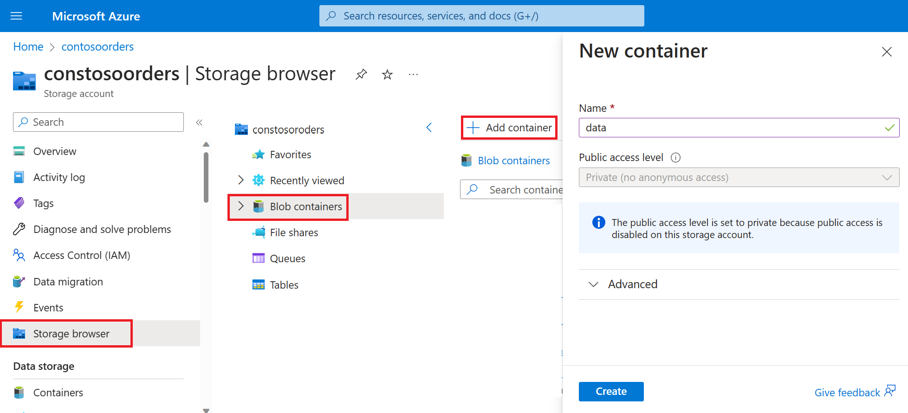
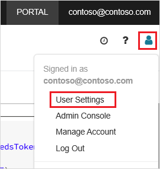
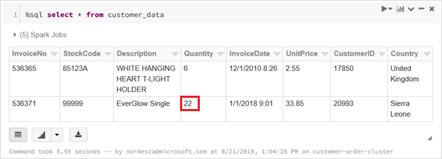

# Tutorial: Implement the data lake capture pattern to update a Databricks Delta table

This tutorial shows you how to handle events in a storage account that has a hierarchical namespace.

You'll build a small solution that enables a user to populate a Databricks Delta table by uploading a comma-separated values (csv) file that describes a sales order. You'll build this solution by connecting together an Event Grid subscription, an Azure Function, and a [Job](/azure/databricks/jobs) in Azure Databricks.

In this tutorial, you will:

> [!div class="checklist"]
> - Create an Event Grid subscription that calls an Azure Function.
> - Create an Azure Function that receives a notification from an event, and then runs the job in Azure Databricks.
> - Create a Databricks job that inserts a customer order into a Databricks Delta table that is located in the storage account.

We'll build this solution in reverse order, starting with the Azure Databricks workspace.

## Prerequisites

- Create a storage account that has a hierarchical namespace (Azure Data Lake Storage). This tutorial uses a storage account named `contosoorders`. 

  See [Create a storage account to use with Azure Data Lake Storage](create-data-lake-storage-account.md).

- Make sure that your user account has the [Storage Blob Data Contributor role](assign-azure-role-data-access.md) assigned to it.

- Create a service principal, create a client secret, and then grant the service principal access to the storage account.

  See [Tutorial: Connect to Azure Data Lake Storage](/azure/databricks/getting-started/connect-to-azure-storage) (Steps 1 through 3). After completing these steps, make sure to paste the tenant ID, app ID, and client secret values into a text file. You'll need those soon.
- If you don't have an Azure subscription, create a [free account](https://azure.microsoft.com/free/?WT.mc_id=A261C142F) before you begin.

## Create a sales order

First, create a csv file that describes a sales order, and then upload that file to the storage account. Later, you'll use the data from this file to populate the first row in our Databricks Delta table.

1. Navigate to your new storage account in the Azure portal.

2. Select **Storage browser**->**Blob containers**->**Add container** and create a new container named **data**.

   > [!div class="mx-imgBorder"]
   > 

3. In the **data** container, create a directory named **input**.

4. Paste the following text into a text editor.

   ```
   InvoiceNo,StockCode,Description,Quantity,InvoiceDate,UnitPrice,CustomerID,Country
   536365,85123A,WHITE HANGING HEART T-LIGHT HOLDER,6,12/1/2010 8:26,2.55,17850,United Kingdom
   ```

5. Save this file to your local computer and give it the name **data.csv**.

6. In storage browser, upload this file to the **input** folder.

## Create a job in Azure Databricks

In this section, you'll perform these tasks:

- Create an Azure Databricks workspace.
- Create a notebook.
- Create and populate a Databricks Delta table.
- Add code that inserts rows into the Databricks Delta table.
- Create a Job.

### Create an Azure Databricks workspace

In this section, you create an Azure Databricks workspace using the Azure portal.

1. Create an Azure Databricks workspace. Name that workspace `contoso-orders`. See [Create an Azure Databricks workspace](/azure/databricks/getting-started/#--create-an-azure-databricks-workspace).

2. Create a cluster. Name the cluster `customer-order-cluster`. See [Create a cluster](/azure/databricks/getting-started/quick-start#step-1-create-a-cluster).

3. Create a notebook. Name the notebook `configure-customer-table` and choose Python as the default language of the notebook. See [Create a notebook](/azure/databricks/notebooks/notebooks-manage#--create-a-notebook). 

### Create and populate a Databricks Delta table

1. In the notebook that you created, copy and paste the following code block into the first cell, but don't run this code yet.

   Replace the `appId`, `password`, `tenant` placeholder values in this code block with the values that you collected while completing the prerequisites of this tutorial.

    ```python
    dbutils.widgets.text('source_file', "", "Source File")

    spark.conf.set("fs.azure.account.auth.type", "OAuth")
    spark.conf.set("fs.azure.account.oauth.provider.type", "org.apache.hadoop.fs.azurebfs.oauth2.ClientCredsTokenProvider")
    spark.conf.set("fs.azure.account.oauth2.client.id", "<appId>")
    spark.conf.set("fs.azure.account.oauth2.client.secret", "<password>")
    spark.conf.set("fs.azure.account.oauth2.client.endpoint", "https://login.microsoftonline.com/<tenant>/oauth2/token")

    adlsPath = 'abfss://data@contosoorders.dfs.core.windows.net/'
    inputPath = adlsPath + dbutils.widgets.get('source_file')
    customerTablePath = adlsPath + 'delta-tables/customers'
    ```

    This code creates a widget named **source_file**. Later, you'll create an Azure Function that calls this code and passes a file path to that widget.  This code also authenticates your service principal with the storage account, and creates some variables that you'll use in other cells.

    > [!NOTE]
    > In a production setting, consider storing your authentication key in Azure Databricks. Then, add a look up key to your code block instead of the authentication key. <br><br>For example, instead of using this line of code: `spark.conf.set("fs.azure.account.oauth2.client.secret", "<password>")`, you would use the following line of code: `spark.conf.set("fs.azure.account.oauth2.client.secret", dbutils.secrets.get(scope = "<scope-name>", key = "<key-name-for-service-credential>"))`. <br><br>After you've completed this tutorial, see the [Azure Data Lake Storage](/azure/databricks/data/data-sources/azure/azure-datalake-gen2) article on the Azure Databricks Website to see examples of this approach.

2. Press the **SHIFT + ENTER** keys to run the code in this block.

3. Copy and paste the following code block into a different cell, and then press the **SHIFT + ENTER** keys to run the code in this block.

   ```python
   from pyspark.sql.types import StructType, StructField, DoubleType, IntegerType, StringType

   inputSchema = StructType([
   StructField("InvoiceNo", IntegerType(), True),
   StructField("StockCode", StringType(), True),
   StructField("Description", StringType(), True),
   StructField("Quantity", IntegerType(), True),
   StructField("InvoiceDate", StringType(), True),
   StructField("UnitPrice", DoubleType(), True),
   StructField("CustomerID", IntegerType(), True),
   StructField("Country", StringType(), True)
   ])

   rawDataDF = (spark.read
    .option("header", "true")
    .schema(inputSchema)
    .csv(adlsPath + 'input')
   )

   (rawDataDF.write
     .mode("overwrite")
     .format("delta")
     .saveAsTable("customer_data", path=customerTablePath))
   ```

   This code creates the Databricks Delta table in your storage account, and then loads some initial data from the csv file that you uploaded earlier.

4. After this code block successfully runs, remove this code block from your notebook.

### Add code that inserts rows into the Databricks Delta table

1. Copy and paste the following code block into a different cell, but don't run this cell.

   ```python
   upsertDataDF = (spark
     .read
     .option("header", "true")
     .csv(inputPath)
   )
   upsertDataDF.createOrReplaceTempView("customer_data_to_upsert")
   ```

   This code inserts data into a temporary table view by using data from a csv file. The path to that csv file comes from the input widget that you created in an earlier step.

2. Copy and paste the following code block into a different cell. This code merges the contents of the temporary table view with the Databricks Delta table.

   ```
   %sql
   MERGE INTO customer_data cd
   USING customer_data_to_upsert cu
   ON cd.CustomerID = cu.CustomerID
   WHEN MATCHED THEN
     UPDATE SET
       cd.StockCode = cu.StockCode,
       cd.Description = cu.Description,
       cd.InvoiceNo = cu.InvoiceNo,
       cd.Quantity = cu.Quantity,
       cd.InvoiceDate = cu.InvoiceDate,
       cd.UnitPrice = cu.UnitPrice,
       cd.Country = cu.Country
   WHEN NOT MATCHED
     THEN INSERT (InvoiceNo, StockCode, Description, Quantity, InvoiceDate, UnitPrice, CustomerID, Country)
     VALUES (
       cu.InvoiceNo,
       cu.StockCode,
       cu.Description,
       cu.Quantity,
       cu.InvoiceDate,
       cu.UnitPrice,
       cu.CustomerID,
       cu.Country)
   ```

### Create a Job

Create a Job that runs the notebook that you created earlier. Later, you'll create an Azure Function that runs this job when an event is raised.

1. Select **New**->**Job**.

2. Give the job a name, choose the notebook that you created and cluster. Then, select **Create** to create the job.

## Create an Azure Function

Create an Azure Function that runs the Job.

1. In your Azure Databricks workspace, click your Azure Databricks username in the top bar, and then from the drop-down list, select **User Settings**.

2. On the **Access tokens** tab, select **Generate new token**.

3. Copy the token that appears, and then click **Done**.

4. In the upper corner of the Databricks workspace, choose the people icon, and then choose **User settings**.

   

5. Select the **Generate new token** button, and then select the **Generate** button.

   Make sure to copy the token to safe place. Your Azure Function needs this token to authenticate with Databricks so that it can run the Job.

6. From the Azure portal menu or the **Home** page, select **Create a resource**.

7. In the **New** page, select **Compute** > **Function App**.

8. In the **Basics** tab of the **Create Function App** page, choose a resource group, and then change or verify the following settings:

   | Setting | Value | 
   |---------|-------|
   | Function App name | contosoorder | 
   | Runtime stack | .NET |
   | Publish | Code |
   | Operating System | Windows |
   | Plan type | Consumption (Serverless) |

9. Select **Review + create**, and then select **Create**. 

   When the deployment is complete, select **Go to resource** to open the overview page of the Function App.

10. In the **Settings** group, select **Configuration**. 

11. In the **Application Settings** page, choose the **New application setting** button to add each setting.

    

    Add the following settings:

    |Setting name | Value |
    |----|----|
    |**DBX_INSTANCE**| The region of your databricks workspace. For example: `westus2.azuredatabricks.net`|
    |**DBX_PAT**| The personal access token that you generated earlier. |
    |**DBX_JOB_ID**|The identifier of the running job. |

9. Select **Save** to commit these settings.

10. In the **Functions** group, select **Functions**, and then select **Create**.

11. Choose **Azure Event Grid Trigger**.

    Install the **Microsoft.Azure.WebJobs.Extensions.EventGrid** extension if you're prompted to do so. If you have to install it, then you'll have to choose **Azure Event Grid Trigger** again to create the function.

    The **New Function** pane appears.

12. In the **New Function** pane, name the function **UpsertOrder**, and then select the **Create** button.

13. Replace the contents of the code file with this code, and then select the **Save** button:

    ```csharp
      #r "Azure.Messaging.EventGrid"
      #r "System.Memory.Data"
      #r "Newtonsoft.Json"
      #r "System.Text.Json"
      using Azure.Messaging.EventGrid;
      using Azure.Messaging.EventGrid.SystemEvents;
      using Newtonsoft.Json;
      using Newtonsoft.Json.Linq;

      private static HttpClient httpClient = new HttpClient();

      public static async Task Run(EventGridEvent eventGridEvent, ILogger log)
      {
         log.LogInformation("Event Subject: " + eventGridEvent.Subject);
         log.LogInformation("Event Topic: " + eventGridEvent.Topic);
         log.LogInformation("Event Type: " + eventGridEvent.EventType);
         log.LogInformation(eventGridEvent.Data.ToString());

         if (eventGridEvent.EventType == "Microsoft.Storage.BlobCreated" || eventGridEvent.EventType == "Microsoft.Storage.FileRenamed") {
            StorageBlobCreatedEventData fileData = eventGridEvent.Data.ToObjectFromJson<StorageBlobCreatedEventData>();
            if (fileData.Api == "FlushWithClose") {
                  log.LogInformation("Triggering Databricks Job for file: " + fileData.Url);
                  var fileUrl = new Uri(fileData.Url);
                  var httpRequestMessage = new HttpRequestMessage {
                     Method = HttpMethod.Post,
                     RequestUri = new Uri(String.Format("https://{0}/api/2.0/jobs/run-now", System.Environment.GetEnvironmentVariable("DBX_INSTANCE", EnvironmentVariableTarget.Process))),
                     Headers = { 
                        { System.Net.HttpRequestHeader.Authorization.ToString(), "Bearer " + System.Environment.GetEnvironmentVariable("DBX_PAT", EnvironmentVariableTarget.Process)},
                        { System.Net.HttpRequestHeader.ContentType.ToString(), "application/json" }
                     },
                     Content = new StringContent(JsonConvert.SerializeObject(new {
                        job_id = System.Environment.GetEnvironmentVariable("DBX_JOB_ID", EnvironmentVariableTarget.Process),
                        notebook_params = new {
                              source_file = String.Join("", fileUrl.Segments.Skip(2))
                        }
                     }))
                  };
                  var response = await httpClient.SendAsync(httpRequestMessage);
                  response.EnsureSuccessStatusCode();
            }
         }
      }
    ```

   This code parses information about the storage event that was raised, and then creates a request message with url of the file that triggered the event. As part of the message, the function passes a value to the **source_file** widget that you created earlier. the function code sends the message to the Databricks Job and uses the token that you obtained earlier as authentication.

## Create an Event Grid subscription

In this section, you'll create an Event Grid subscription that calls the Azure Function when files are uploaded to the storage account.

1. Select **Integration**, and then in the **Integration** page, select **Event Grid Trigger**.

2. In the **Edit Trigger** pane, name the event `eventGridEvent`, and then select **Create Event subscription**.

   > [!NOTE]
   > The name `eventGridEvent` matches the parameter named that is passed into the Azure Function.

3. In the **Basics** tab of the **Create Event Subscription** page, change or verify the following settings:

   | Setting | Value | 
   |---------|-------|
   | Name | contoso-order-event-subscription | 
   | Topic type | Storage account |
   | Source Resource | contosoorders |
   | System topic name | `<create any name>` |
   | Filter to Event Types | Blob Created, and Blob Deleted |

4. Select the **Create** button.

## Test the Event Grid subscription

1. Create a file named `customer-order.csv`, paste the following information into that file, and save it to your local computer.

   ```
   InvoiceNo,StockCode,Description,Quantity,InvoiceDate,UnitPrice,CustomerID,Country
   536371,99999,EverGlow Single,228,1/1/2018 9:01,33.85,20993,Sierra Leone
   ```

2. In Storage Explorer, upload this file to the **input** folder of your storage account.

   Uploading a file raises the **Microsoft.Storage.BlobCreated** event. Event Grid notifies all subscribers to that event. In our case, the Azure Function is the only subscriber. The Azure Function parses the event parameters to determine which event occurred. It then passes the URL of the file to the Databricks Job. The Databricks Job reads the file, and adds a row to the Databricks Delta table that is located your storage account.

3. To check if the job succeeded, view the runs for your job. You'll see a completion status. For more information about how to view runs for a job, see [View runs for a job](/azure/databricks/workflows/jobs/jobs#--view-runs-for-a-job)

4. In a new workbook cell, run this query in a cell to see the updated delta table.

   ```
   %sql select * from customer_data
   ```

   The returned table shows the latest record.

   

5. To update this record, create a file named `customer-order-update.csv`, paste the following information into that file, and save it to your local computer.

   ```
   InvoiceNo,StockCode,Description,Quantity,InvoiceDate,UnitPrice,CustomerID,Country
   536371,99999,EverGlow Single,22,1/1/2018 9:01,33.85,20993,Sierra Leone
   ```

   This csv file is almost identical to the previous one except the quantity of the order is changed from `228` to `22`.

6. In Storage Explorer, upload this file to the **input** folder of your storage account.

7. Run the `select` query again to see the updated delta table.

   ```
   %sql select * from customer_data
   ```

   The returned table shows the updated record.

   

## Clean up resources

When they're no longer needed, delete the resource group and all related resources. To do so, select the resource group for the storage account and select **Delete**.

## Next steps

> [!div class="nextstepaction"]
> [Reacting to Blob storage events](storage-blob-event-overview.md)
