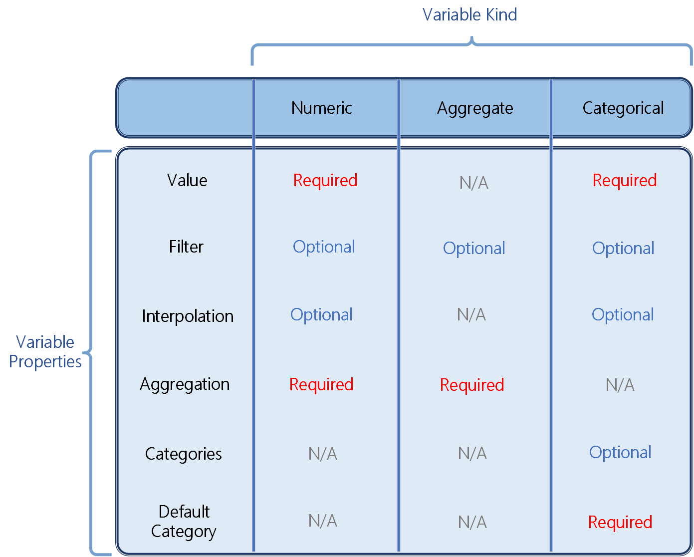

# Time Series Model variables

[!INCLUDE [retirement](../../includes/tsi-retirement.md)]

This article describes the Time Series Model variables that specify formula and computation rules on events.

Each variable can be one of three kinds: *numeric*, *categorical*, and *aggregate*.

* **Numeric** kinds work with continuous numeric values.
* **Categorical** kinds work with a defined set of discrete values.
* **Aggregate** kinds combine multiple variables of a single kind (either all numeric or all categorical).

The following table displays which properties are relevant for each variable kind.

[](media/v2-update-tsm/time-series-model-variable-table.png#lightbox)

## Numeric variables

| Variable property | Description |
| --- | ---|
| Variable filter | Filters are optional conditional clauses to restrict the number of rows being considered for computation. |
| Variable value | Telemetry values used for computation coming from the device or sensors or transformed by using Time Series Expressions. Numeric kind variables must be either `Double` or `Long` to match the data type of the incoming data.|
| Variable interpolation | Interpolation specifies how to reconstruct a signal by using existing data. *Step* and *Linear* interpolation options are available for numeric variables. |
| Variable aggregation | Perform computations through the supported [aggregation functions for Numeric variable kinds](/rest/api/time-series-insights/reference-time-series-expression-syntax#numeric-variable-kind). |

Variables conform to the following JSON example:

```JSON
"Interpolated Speed": {
  "kind": "numeric",
  "value": {
    "tsx": "$event['Speed-Sensor'].Double"
  },
  "filter": null,
  "interpolation": {
    "kind": "step",
    "boundary": {
      "span": "P1D"
    }
  },
  "aggregation": {
    "tsx": "right($value)"
  }
}
```

## Categorical variables

| Variable property | Description |
| --- | ---|
| Variable filter | Filters are optional conditional clauses to restrict the number of rows being considered for computation. |
| Variable value | Telemetry values used for computation coming from the device or sensors. Categorical kind variables must be either `Long` or `String` to match the data type of the incoming data. |
| Variable interpolation | Interpolation specifies how to reconstruct a signal by using existing data. The *Step* interpolation option is available for categorical variables. |
| Variable categories | Categories create a mapping between the values coming from the device or sensors to a label. |
| Variable default category | The default category is for all values that aren't being mapped in the "categories" property. |

Variables conform to the following JSON example:

```JSON
"Status": {
  "kind": "categorical",
  "value": {
     "tsx": "$event.Status.Long"
},
  "interpolation": {
    "kind": "step",
    "boundary": {
      "span" : "PT1M"
    }
  },
  "categories": [
    {
      "values": [0, 1, 2, 3],
      "label": "Good"
    },
    {
      "values": [4],
      "label": "Bad"
    }
  ],
  "defaultCategory": {
    "label": "Not Applicable"
  }
}
```

## Aggregate variables

| Variable property | Description |
| --- | ---|
| Variable filter | Filters are optional conditional clauses to restrict the number of rows being considered for computation. |
| Variable aggregation | Perform computations through the supported [aggregation functions for Aggregate variable kinds](/rest/api/time-series-insights/reference-time-series-expression-syntax#aggregate-variable-kind). |

Variables conform to the following JSON example:

```JSON
"Speed Range": {
  "kind": "aggregate",
  "filter": null,
  "aggregation": {
    "tsx": "max($event.Speed.Double) - min($event.Speed.Double)"
  }
}
```

Variables are stored in the type definition of a time series model and can be provided inline via APIs to override or complement the stored definition.

## Next steps

* Learn more about [Time Series Model](./concepts-model-overview.md).

* Read more about how to define variables inline using [Query APIs](./concepts-query-overview.md).
